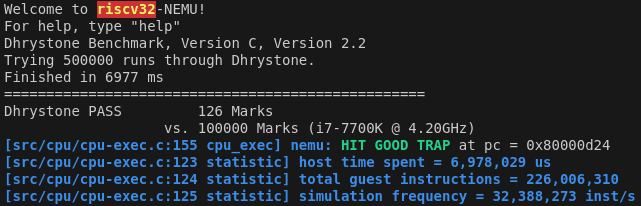
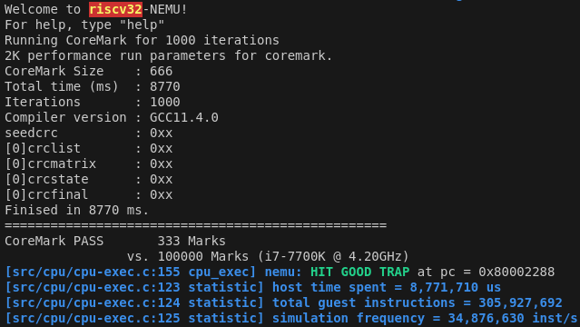
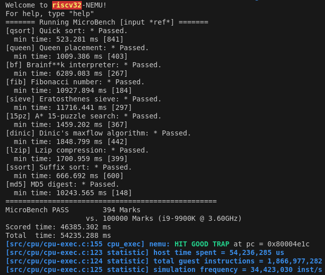

# nemu的设备和输入输出
输入输出是计算机与外界交互的基本手段, 已经在nemu上实现TRM了, 下一步是让它支持输入输出(完成pa2阶段3)

## 设备与CPU
在真实的计算机中, 输入输出都是通过访问I/O设备来完成的, 在程序看来, 访问设备 = 读出数据 + 写入数据 + 控制状态. 

CPU除了进行计算之外, 还需要访问设备, 一种最简单的方法就是把设备的寄存器作为接口, 让CPU来访问这些寄存器, 常用的I/O编址方式:

- 端口映射I/O(port-mapped I/O): CPU使用专门的I/O指令对设备进行访问, 并把设备的地址称作端口号. 有了端口号以后, 在I/O指令中给出端口号, 就知道要访问哪一个设备寄存器了. 但是 端口映射I/O所能访问的I/O地址空间的大小, 在设计I/O指令的那一刻就已经决定下来了
- 内存映射I/O(memory-mapped I/O, MMIO): 通过不同的物理内存地址给设备编址. 这种编址方式将一部分物理内存的访问"重定向"到I/O地址空间中, CPU尝试访问这部分物理内存的时候, 实际上最终是访问了相应的I/O设备. 这样CPU就可以通过普通的访存指令来访问设备

## 理解volatile关键字
编写 [test_volatile.c](./volatile/test_volatile.c) 和去掉volatile关键词的 [test.c](./volatile/test.c)，分别使用`-O2`编译并查看反汇编:

```sh
(base) xinchen@sakura:~/ysyx/docs/10/volatile$ riscv64-linux-gnu-gcc -c -march=rv32g -mabi=ilp32 -O2 test.c
(base) xinchen@sakura:~/ysyx/docs/10/volatile$ riscv64-linux-gnu-objdump -d test.o > test.asm
(base) xinchen@sakura:~/ysyx/docs/10/volatile$ riscv64-linux-gnu-gcc -c -march=rv32g -mabi=ilp32 -O2 test_volatile.c
(base) xinchen@sakura:~/ysyx/docs/10/volatile$ riscv64-linux-gnu-objdump -d test_volatile.o > test_volatile.asm
(base) xinchen@sakura:~/ysyx/docs/10/volatile$ rm test.o
(base) xinchen@sakura:~/ysyx/docs/10/volatile$ rm test_volatile.o
```

通过使用volatile关键字，告诉编译器不要对指针p所指向的地址进行优化，保证每次访问都从内存中读取或写入值，确保与设备寄存器的正确交互

## 状态机视角下的输入输出

```
状态机模型            |           状态机模型之外
S = <R, M>          |        D
计算机/程序  <----I/O指令----> 设备 <----模拟电路----> 物理世界
                    |
                    |
```

要对设备的状态和行为进行建模是一件很困难的事情, 除了设备本身的行为五花八门之外, 设备的状态还时时刻刻受到物理世界的影响. 于是, 我们在对状态机模型的行为进行扩展的时候, 并不考虑将D加入到S中, 而是仅仅对输入输出相关指令的行为进行建模

- 执行普通指令时, 状态机按照TRM的模型进行状态转移
- 执行设备输出相关的指令(如x86的out指令或者RISC架构的MMIO写指令)时, 状态机除了更新PC之外, 其它状态均保持不变, 但设备的状态和物理世界则会发生相应的变化
- 执行设备输入相关的指令(如x86的in指令或者RISC架构的MMIO读指令)时, 状态机的转移将会"分叉": 状态机不再像TRM那样有唯一的新状态了, 状态机具体会转移到哪一个新状态, 将取决于执行这条指令时设备的状态

这个扩展之后的状态机模型从微观的角度告诉我们, 设备的输入输出都是通过CPU的寄存器来进行数据交互的

当然也有通过内存进行数据交互的输入输出: DMA

## nemu中的输入输出
NEMU的框架代码已经在nemu/src/device/目录下提供了设备相关的代码

### I/O映射模拟方式

框架代码为映射定义了一个结构体类型IOMap(在`nemu/include/device/map.h`中), 包括名字, 映射的起始地址和结束地址, 映射的目标空间, 以及一个回调函数. 然后在`nemu/src/device/io/map.c`实现了映射的管理, 包括I/O空间的分配及其映射, 还有映射的访问接口.

其中`map_read()`和`map_write()`用于将地址addr映射到map所指示的目标空间, 并进行访问. 访问时, 可能会触发相应的回调函数, 对设备和目标空间的状态进行更新. 由于NEMU是单线程程序, 因此只能串行模拟整个计算机系统的工作, 每次进行I/O读写的时候, 才会调用设备提供的回调函数(callback). 基于这两个API, 可以很容易实现端口映射I/O和内存映射I/O的模拟

具体的, `paddr_read()`和`paddr_write()`会判断地址addr落在物理内存空间还是设备空间, 若落在物理内存空间, 就会通过`pmem_read()`和`pmem_write()`来访问真正的物理内存; 否则就通过`map_read()`和`map_write()`来访问相应的设备. 从这个角度来看, 内存和外设在CPU来看并没有什么不同, 只不过都是一个字节编址的对象而已.

### 设备
NEMU实现了串口, 时钟, 键盘, VGA, 声卡, 磁盘, SD卡七种设备，都不可编程. 需要在menuconfig开启Device选项，即可开启设备支持

NEMU使用SDL库来实现设备的模拟, `nemu/src/device/device.c`含有和SDL库相关的代码. `init_device()`函数主要进行以下工作:
- 调用`init_map()`进行初始化
- 对上述设备进行初始化, 其中在初始化VGA时还会进行一些和SDL相关的初始化工作, 包括创建窗口, 设置显示模式等
- 定时器(alarm)相关的初始化工作. 定时器的功能在PA4最后才会用到, 目前可以忽略它

`cpu_exec()`在执行每条指令之后就会调用`device_update()`函数, 这个函数首先会检查距离上次设备更新是否已经超过一定时间, 若是, 则会尝试刷新屏幕, 并进一步检查是否有按键按下/释放, 以及是否点击了窗口的X按钮; 否则则直接返回, 避免检查过于频繁, 因为上述事件发生的频率是很低的

为了使得DiffTest可以正常工作, 框架代码在访问设备的过程中调用了`difftest_skip_ref()`函数 (见`nemu/include/device/map.h`中定义的`find_mapid_by_addr()`函数)来跳过与REF的检查

## 将输入输出抽象成IOE
设备访问的具体实现是架构相关的; 与TRM不同, 设备访问是为计算机提供输入输出的功能, 因此把它们划入一类新的API: IOE(I/O Extension). 在 `abstract-machine/am/src/platform/nemu/ioe/ioe.c` 中实现了3个api:

```c
bool ioe_init();
void ioe_read(int reg, void *buf);
void ioe_write(int reg, void *buf);
```

第一个API用于进行IOE相关的初始化操作. 后两个API分别用于从编号为reg的寄存器中读出内容到缓冲区buf中, 以及往编号为reg寄存器中写入缓冲区buf中的内容. 需要注意的是, 这里的reg寄存器并不是上文讨论的设备寄存器, 因为设备寄存器的编号是架构相关的. 在IOE中, 我们希望采用一种架构无关的"抽象寄存器", 这个reg其实是一个功能编号, 我们约定在不同的架构中, 同一个功能编号的含义也是相同的, 这样就实现了设备寄存器的抽象. `abstract-machine/am/include/amdev.h`中定义了常见设备的"抽象寄存器"编号和相应的结构. 为了方便地对这些抽象寄存器进行访问, klib中提供了`io_read()`和`io_write()`两个宏, 它们分别对`ioe_read()`和`ioe_write()`这两个API进行了进一步的封装

NEMU作为一个平台, 设备的行为是与ISA无关的, 因此我们只需要在`abstract-machine/am/src/platform/nemu/ioe/`目录下实现一份IOE, 来供NEMU平台的架构共享

## 串口
串口是最简单的输出设备. `nemu/src/device/serial.c`模拟了串口的功能, 只保留了数据寄存器. 

串口初始化时会注册`0xa00003F8`处长度为8字节的MMIO空间映射到串口的数据寄存器. 由于NEMU串行模拟计算机系统的工作, 串口的状态寄存器可以一直处于空闲状态; 每当CPU往数据寄存器中写入数据时, 串口会将数据传送到主机的标准错误流进行输出.

`abstract-machine/am/src/platform/nemu/trm.c`中的`putch()`就是通过串口输出的, 然而AM把`putch()`放在TRM, 而不是IOE中: `putch()`的加入让TRM具有输出字符的能力, 被扩充后的TRM更靠近一个实用的机器, 而不再是只会计算的数学模型

### 运行Hello World:
在`am-kernels/kernels/hello/`目录下键入`make ARCH=riscv32-nemu run mainargs=test`就可以在终端看到对应的输出

- 对于`riscv32-nemu`来说, mainargs是通过命令行传递给 `$AM_HOME/scripts/platform/nemu.mk` 中的语句 `CFLAGS += -DMAINARGS=\"$(mainargs)\"`, 从而定义了MAINARGS宏. 之后在`$AM_HOME/am/src/platform/nemu/trm.c`中使用了MAINARGS宏来输入给程序
- 对于`native`来说, 获取mainargs的相关代码在`abstract-machine/am/src/native/platform.c`中, 通过`getenv()`获取的

### 实现printf
有了`putch()`, 就可以在klib中实现`printf()`了. 之前已经实现了`sprintf()`, 它和`printf()`的功能非常相似, 这意味着它们之间会有不少重复的代码. 实现了`printf()`之后, 就可以在AM程序中使用输出调试法了

- 运行`am-kernels/tests/alu-tests/`目录下alu-tests: `make ARCH=riscv32-nemu run`, 发现这是个alu测试用例生成器，如果没有错误不会调用printf函数，也就不会报错，通过给生成的`alu_test.c`注入错误，就能够验证printf的正确性
- 实现了位宽功能, 测试程序位于`am-kernels/tests/klib-tests/printf_test`
- 当前的`printf()`还很不完善, 十六进制, 精度等需要的时候再实现

## 时钟
`nemu/src/device/timer.c` 模拟了i8253计时器的功能, 保留了"发起时钟中断"的功能, 同时添加了一个自定义的时钟. i8253计时器初始化时会注册`0xa0000048`处长度为8字节的MMIO空间映射到两个32位的RTC寄存器. CPU可以访问这两个寄存器来获得用64位表示的当前时间

**为什么不设置一个64位的RTC寄存器**: 希望设备的设计与CPU解耦, 32位的CPU无法一次访问64位的设备寄存器, 因此将一个64位的功能拆分成两个32位的设备寄存器, 可同时支持接入32位和64位CPU

`abstract-machine/am/include/amdev.h`中为时钟的功能定义了两个抽象寄存器:
- AM_TIMER_RTC, AM实时时钟(RTC, Real Time Clock), 可读出当前的年月日时分秒. PA中暂不使用
- AM_TIMER_UPTIME, AM系统启动时间, 可读出系统启动后的微秒数

### 实现IOE
在 `abstract-machine/am/src/platform/nemu/ioe/timer.c` 中实现AM_TIMER_UPTIME的功能:

- `abstract-machine/am/src/platform/nemu/include/nemu.h` 中的RTC_ADDR宏提供了8字节的MMIO空间的起始地址; `abstract-machine/am/src/$ISA/$ISA.h` 中的`inl()`函数提供了根据地址读取32位寄存器的方法
- 实现后, 在riscv32-nemu中运行`am-kernel/tests/am-tests`中的real-time clock test测试. rtfc知道对应命令为 `make ARCH=riscv32-nemu run mainargs=t`
- 看到程序每隔1秒往终端输出一行信息，实现位宽后显示正常(若未实现, 行中有`02d`等内容); 由于没有实现AM_TIMER_RTC, 测试应当总是输出1900年0月0日0时0分0秒, 这属于正常行为

### 看看NEMU跑多快
有了时钟之后, 我们就可以测试一个程序跑多快, 从而测试计算机的性能

- 尝试在NEMU中依次运行以下benchmark(已经按照程序的复杂度排序, 均在`am-kernel/benchmarks/`目录下):dhrystone, coremark, microbench 
- 跑分时关闭NEMU的监视点, trace以及DiffTest, 同时取消menuconfig中的`Enable debug information`并重新编译NEMU, 以获得较为真实的跑分
- coremark和dhrystone结果显示 "Finised in 0 ms." 并且报错 "Floating point exception (core dumped)". rtfsc发现是跑分程序最后计算分值的时候做了浮点除法，r如在dhrystone中除数有User_time，而User_time为0，从而发生浮点错误. 而获取时间使用的是`timer.c`中刚实现的AM_TIMER_UPDATE. 继续rtfsc查看接口与回调函数等，发现`$NEMU_HOME/src/device/timer.c` 中回调函数 `rtc_io_handler()`只有在offset为4的时候才更新时间，也就是说当读取低32位rtc的时候事实上读取的是上一次更新的结果，因此修改为在offset为0时更新低32位，offset为4时更新高32位

- dhrystone跑分结果:



- coremark跑分结果:



- microbench的ref规模跑分结果(在参考值范围内):



### 运行具有演示性的小程序
为了运行它们, 需要实现简单的版的klib中的`malloc()`和`free()`

- 在`malloc()`中维护一个上次分配内存位置的变量addr, 每次调用`malloc()`时, 就返回`[addr, addr + size)`这段空间. addr的初值设为`heap.start`, 表示从堆区开始分配. 具体实现参考了microbench中的`bench_alloc`和`bench_reset()`函数
- `malloc()`对返回的地址要求对于所有的数据类型对齐，最大为64位，因此选择8字节对齐
- `free()`直接留空, 表示只分配不释放, 目前NEMU中的可用内存足够运行各种测试程序
- 修改`am-kernels/kernels/demo/include/io.h`中的代码, 把`HAS_GUI`宏注释掉, 演示程序就会将画图通过字符输出到终端
- 在 `am-kernels/kernels/demo/` 中通过 `make ARCH=riscv32-nemu run mainargs=*` 即可运行查看结果(其中*对应程序序号，具体rtfsc)
- 在`am-kernels/kernels/bad-apple/`目录下还可以运行字符版 bad apple
- 运行红白机模拟器, 可以在NEMU上运行字符版本的FCEUX. 修改`fceux-am/src/config.h`中的代码, 把HAS_GUI宏注释掉, FCEUX就会通过`putch()`来输出画面. 然后参考pa1中运行FCEUX的方式, 来将超级玛丽运行在nemu上. 为了获得比较好的显示效果, 需要在一个不少于60行的终端中运行. 由于此时还没有实现键盘, 不能对游戏进行操作, 但可以观看超级玛丽自带的演示(需要在开始界面中等待约10秒)