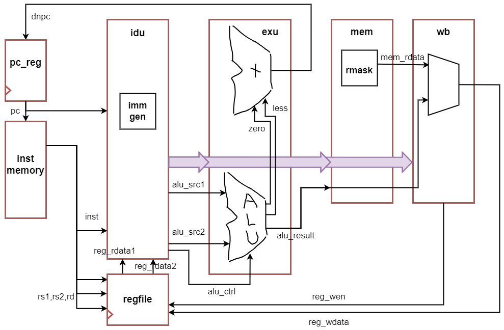

# 支持RV32E的单周期NPC
- 采用RV32E指令集来设计npc (启动Linux使用RV64IMAC)
- RV32E的程序可以直接运行在RV32IM的处理器上, 因此可以把RV32IM的NEMU作为DiffTest的REF

## 搭建面向riscv32e-npc的运行时环境
AM项目已经提供了riscv32e-npc的基本框架, 只需要在 `am-kernels/tests/cpu-tests/` 目录下执行 `make ARCH=riscv32e-npc ALL=xxx` 即可将名为xxx的测试编译到riscv32e-npc的运行时环境中

### 从命令行中读入NPC需要执行的程序
接下来将会在NPC中不断地运行各种程序, 如果每次运行新程序都要重新编译NPC, 效率是很低的. 为了提高效率, 可以让仿真环境从命令行中读入程序的路径, 然后把程序内容放置到存储器中

- 参考nemu的参数读入，使用`getopt()`来读取命令行提供的`IMG`参数
- IMG参数由Makefile通过`make sim IMG=--img=xxx`的方式指定, 与am在调用nemu时的传递程序路径的方法相同(具体rtfsc: `$AM_HOME/scripts/platform/nemu.mk`)
- 根据nemu的存储器重构了仿真环境的存储器
- 使用`make sim IMG=--img=./default/dummy-riscv32e-npc.bin`测试，成功读入

### 一键编译并在NPC上运行AM程序
在AM项目中, 为riscv32e-npc提供run目标, 使得键入`make ARCH=riscv32e-npc ALL=xxx run`即可把AM程序编译并在NPC上运行

- 参考`$AM_HOME/scripts/platform/nemu.mk`, 为`$AM_HOME/scripts/platform/npc.mk`添加run目标, 即可直接将am程序编译到npc上

### 在NPC上运行dummy程序
sw指令需要访存内存, 不过对于dummy程序来说, 不实现也不影响运行的结果. 因此目前可以将它实现成空指令, 后面再来正确地实现它. 在架构图上添加auipc, lui, jal, jalr的电路. 实现上述指令, 使得NPC可以运行dummy程序:


修改rtl，添加了新的指令译码和执行，更新pc的生成逻辑, 此时查看波形:


### 实现riscv32e-npc中的halt()函数
为了可以自动地结束程序, 需要在riscv32e-npc中实现TRM的`halt()`函数, 在其中添加一条ebreak指令. 实现之后,就可以通过一条命令自动在NPC上运行AM程序并自动结束仿真了

- 参考`$AM_HOME/am/src/platform/nemu/include/nemu.h`, 在`$AM_HOME/am/src/riscv/npc/trm.c`添加内联汇编，并在`halt()`函数中调用

### 为NPC实现HIT GOOD/BAD TRAP
为NPC实现`HIT GOOD`/`BAD TRAP`, 输出程序是否成功结束执行的信息:

- rtfsc, 发现nemu中的相关功能是通过判断客户程序的返回值实现的
- 注意到之前实现ebreak的时候，内联汇编会把程序的返回值保存到寄存器a0中，因此只需要在仿真环境中读取a0的值作出判断
- 阅读verilator编译得到的头文件，发现可以通过`top->rootp->xcore__DOT__regfile_u0__DOT__regs[10]`的方式来访问a0寄存器
- 使得仿真环境返回该值即可

## 为NPC搭建基础设施
在PA中有四大基础设施: sdb, trace, native, DiffTest. 除了native属于AM之外, 其余三大基础设施都可以在NPC中搭建

### 为NPC搭建sdb
为NPC实现单步执行, 打印寄存器和扫描内存的功能, 而表达式求值和监视点都是基于打印寄存器和扫描内存实现的:

- 首先根据nemu重构了访存系统和log(保存到`build/npc.log`)，并移植了monitor
- 移植sdb时涉及readline和history库，不仅需要包括头文件，还要在makefile中添加链接选项`-lreadline`
- 通过Verilator编译出的C++文件来访问通用寄存器，如`dut->rootp->xcore__DOT__regfile_u0__DOT__regs[i]`表示第i个寄存器
- 在npc仿真环境中构造了一组寄存器，在每次执行后与rtl模型进行同步，这样接口更清晰
- 在`main.cpp`中生命了一部分全局变量，这样方便sdb与monitor使用

### 为NPC添加trace支持
在NPC中实现itrace, mtrace和ftrace

#### itrace
- 重新编写DPI-C，来获取当前运行的指令，用于判断ebreak与itrace
- 链接llvm库, 具体参考`$NEMU_HOME/src/utils/filelist.mk`: 主要是为Makefile添加源文件、编译规则和链接规则; 在使用函数时需要声明
- 具体的itrace参考nemu, 反汇编需要在monitor中初始化

#### ftrace
- 为`parse_args()`提供解析elf文件的选项`--elf`，从而读取到函数信息(默认的elf位于`$NPC_HOME/default/`目录下)
- 还是整体移植了nemu的ftrace,主要实现部分位于给予核激励阶段

#### mtrace
- npc实现访存指令后再实现

### 为NPC添加DiffTest支持
在这里DUT是npc, 而REF则选择nemu

- 在`nemu/src/cpu/difftest/ref.c`中实现DiffTest的API, 包括`difftest_memcpy()`, `difftest_regcpy()`和`difftest_exec()`. 此外`difftest_raise_intr()`是为中断准备的, 目前暂不使用; 其中`difftest_memcpy`只实现了写入REF，`difftest_regcpy()`实现了双向读写(由于npc一定是DUT)
- 在nemu的menuconfig中选择共享库作为编译的目标`Build target`: `(X) Shared object (used as REF for differential testing)`. 重新编译nemu, 成功后将会生成动态库文件`nemu/build/riscv32-nemu-interpreter-so`, 将其作为参数传入, 供npc动态链接
- 移植difftest的dut功能到npc，并在`trace_and_difftest()`中进行调用
- 需要为nemu开启`RVE`拓展,否则`difftest_regcpy()`会有错误
- 在打开DiffTest机制的情况下在npc中正确运行dummy程序； 为了检查DiffTest机制是否生效, 为NPC中addi指令的实现注入一个错误，difftest能够及时报告

## 实现RV32E指令集

### 硬件如何区分有符号数和无符号数
编写 test.c:
```c
#include <stdint.h>
int32_t fun1(int32_t a, int32_t b) { return a + b; }
uint32_t fun2(uint32_t a, uint32_t b) { return a + b; }
```

`riscv64-linux-gnu-gcc -c -march=rv32g -mabi=ilp32 -O2 test.c`编译, `riscv64-linux-gnu-objdump -d test.o`反汇编:

```asm
Disassembly of section .text:

00000000 <fun1>:
   0:	00b50533          	add	a0,a0,a1
   4:	00008067          	ret

00000008 <fun2>:
   8:	00b50533          	add	a0,a0,a1
   c:	00008067          	ret
```

发现两个函数的汇编指令序列是一样的，说明对于有符号整数和无符号整数的加法操作，处理器执行的指令序列是相同的，换句话说处理器并不关心操作数的符号位，而是按照位级进行操作

### 访存
访存指令需要访问存储器, 与取指不同, 访存指令还可能需要将数据写入存储器. 之前把取指的接口拉到顶层的简单实现方式, 并不能正确实现访存指令, 这是因为访存接口的信号会依赖于当前取到的指令, 而仿真环境无法正确地处理这个依赖关系. 可以通过DPI-C机制来实现访存:

- 当前，通过在仿真环境的`paddr.c`中添加`int dpic_pmem_read(int raddr)`函数(由于32位总线只支持地址按4字节对齐的读写, 其中读操作总是返回按4字节对齐读出的数据，因此需要掩码总是读取地址为`raddr & ~0x3u`的4字节返回)，实现了指令存储器的读取，并在verilog中添加实现指令存储器的读取:
- `void dpic_pmem_write(int waddr, int wdata, char wmask)`函数同理，但除了地址掩码外，还有数据掩码需要实现: `wmask`中每比特表示`wdata`中1个字节的掩码,如`wmask = 0x3`代表只写入最低2个字节, 内存中的其它字节保持不变
- 对于取指, 删除了之前把信号拉到顶层的实现, 然后额外调用一次`dpic_pmem_read()`来实现. 此时顶层信号只有clk和rst_n
- 对于指令存储器，为了保证时序，将其设定为组合电路，读取指令不需要时钟. 因此对于dummy程序来说每个时钟上升沿电路的实际动作是写入寄存器和更新pc
- 实现了mtrace，在`dpic_pmem_read()`与`dpic_pmem_write()`中添加输出即可


### RV32E架构图


- 单周期处理器架构图如上所示，主要信号已列出
- 单周期处理器的主要时序单元pc寄存器和寄存器堆都是异步读，上升沿同步写，这样才能保证一个周期执行一条指令
- 对于load/store指令，可能会存在非对齐的访存，需要根据偏移的地址将数据与掩码进行正确的移位
- RV32E对应的指令就是RV32I，只不过RV32I有32个寄存器，RV32E只使用了16个 (实现了32个，但没用)

### 在NPC中正确运行所有cpu-tests
- RV32E不包含乘除指令, gcc将会把乘除法操作编译成形如`__mulsi3()`的函数调用, 这些函数用于提供整数算术运算操作的软件模拟版本, 即用加减操作计算出乘除法的结果
- 最终的单周期处理器能够成功运行所有的cpu-tests
- 部分`cpu-tests`仿真时间较长, 需要合理修改最大仿真时间

###  观察ALU的综合结果
尝试使用yosys-sta项目对ALU进行综合, 观察综合结果, 回答如下问题:

#### 我们知道, 补码减法可以用加法器来实现, 而比较指令和分支指令本质上也需要通过补码减法来实现. 如果我们在RTL代码中直接编写`-`或`<`等各种运算符, yosys能否自动将它们的减法功能合并为同一个加法器?
#### 移位运算符`<<`和`>>`被yosys综合成什么电路?
#### yosys从运算符直接综合出电路是否有改进的空间?
