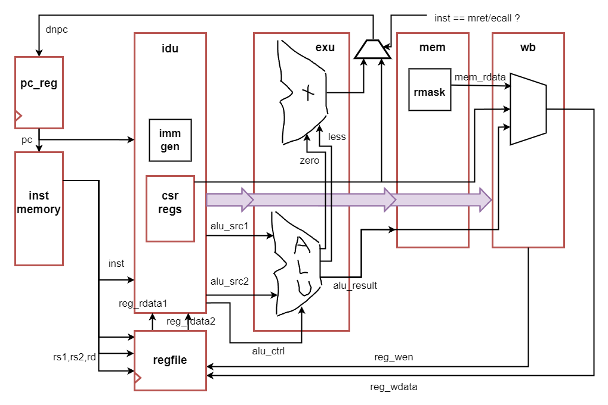

# 异常处理和RT-Thread
实现IOE后, 接下来在nemu和npc上实现CTE, 就可以运行不简单的操作系统了

## 在NEMU中实现自陷操作(pa3阶段1)
### 批处理系统
要有一个后台程序(操作系统), 当一个前台程序执行结束的时候, 后台程序就会自动加载一个新的前台程序来执行

程序之间的执行流切换不用jal: 希望保护操作系统, 当用户程序崩溃时操作系统依然正常工作

#### 什么是操作系统(二周目回答)?

特权模式: 以支持现代操作系统的RISC-V处理器为例, 它们存在M, S, U三个特权模式, 分别代表机器模式, 监管者模式和用户模式. M模式特权级最高, U模式特权级最低. 通常来说, 操作系统运行在S模式, 因此有权限访问所有的代码和数据; 而一般的程序运行在U模式, 这就决定了它只能访问U模式的代码和数据. 这样, 只要操作系统将其私有代码和数据放S模式中, 恶意程序就永远没有办法访问到它们. 为了简化，NEMU中加让所有用户进程都运行在最高特权级

### 自陷指令
中断/异常响应机制(ISA规范): 一种可以限制入口的执行流切换方. 程序执行自陷指令之后, 就会陷入到操作系统预先设置好的跳转目标, 这个跳转目标也称为异常入口地址

### riscv32异常响应机制
riscv32提供`ecall`指令作为自陷指令. 为了保存程序当前的状态, 需要一些特殊的系统寄存器(控制状态寄存器, CSR寄存器). 在PA中, 我们用到了4个CSR寄存器:

- `mtvec`寄存器: 存放异常入口地址
- `mepc`寄存器: 存放触发异常的PC
- `mstatus`寄存器: 存放处理器的状态
- `mcause`寄存器: 存放触发异常的原因

riscv32触发异常后硬件的响应过程如下:

1. 将当前PC值保存到mepc寄存器
2. 在mcause寄存器中设置异常号
3. 从mtvec寄存器中取出异常入口地址
4. 跳转到异常入口地址

由于异常入口地址是硬件和操作系统约定好的, 接下来的处理过程将会由操作系统来接管, 操作系统将视情况决定是否终止当前程序的运行(例如触发段错误的程序将会被杀死). 若决定无需杀死当前程序, 等到异常处理结束之后, 就根据之前保存的信息恢复程序的状态, 并从异常处理过程中返回到程序触发异常之前的状态

riscv32通过`mret`指令从异常处理过程中返回, 它将根据mepc寄存器恢复PC

### 将上下文管理抽象成CTE
与IOE一样, 上下文管理的具体实现也是架构相关的: 例如x86/mips32/riscv32中分别通过int/syscall/ecall指令来进行自陷, 可以将上下文管理的功能划入到AM的一类新的API中, 名字叫CTE(ConText Extension)

考虑需要的api, 操作系统需要用到的信息有:
- 引发这次执行流切换的原因, 是程序除0, 非法指令, 还是触发断点, 又或者是程序自愿陷入操作系统? 根据不同的原因, 操作系统都会进行不同的处理
- 程序的上下文了, 在处理过程中, 操作系统可能会读出上下文中的一些寄存器, 根据它们的信息来进行进一步的处理. 例如操作系统读出PC所指向的非法指令, 看看其是否能被模拟执行. 事实上, 通过这些上下文, 操作系统还能实现一些神奇的功能, 在PA4中了解更详细的信息

抽象CTE api所需要的信息: 
- 引发执行流切换的原因: `$AM_HOME/am/include/am.h`中定义了Event, 让每个架构在实现各自的CTE API时, 都统一通过上述结构体来描述执行流切换的原因, 就可以实现切换原因的抽象了
- 程序的上下文: `$AM_HOME/am/include/arch/riscv.h`中定义了Context

两个统一的API:

- `bool cte_init(Context* (*handler)(Event ev, Context *ctx))`: 用于进行CTE相关的初始化操作. 其中它还接受一个来自操作系统的事件处理回调函数的指针, 当发生事件时, CTE将会把事件和相关的上下文作为参数, 来调用这个回调函数, 交由操作系统进行后续处理
- `void yield()` 用于进行自陷操作, 会触发一个编号为EVENT_YIELD事件. 不同的ISA会使用不同的自陷指令来触发自陷操作

### 设置异常入口地址
`abstract-machine/am/src/$ISA/nemu/cte.c中的cte_init()`函数会做两件事情, 第一件就是设置异常入口地址: 对于riscv32来说, 直接将异常入口地址设置到mtvec寄存器中即可; 第二件事是注册一个事件处理回调函数

### 实现异常响应机制
实现新指令, 并实现`isa_raise_intr()`函数. 然后阅读`cte_init()`的代码, 找出相应的异常入口地址. 对于riscv32, 会发现status/mstatus寄存器中有非常多状态位, 不过目前完全不实现这些状态位的功能也不影响程序的执行, 因此目前只需要将status/mstatus寄存器看成一个只用于存放32位数据的寄存器即可

- 在 `$NEMU_HOME/src/isa/riscv32/include/isa-def.h` 中添加4个用到的csr寄存器
- 参考`cte_init()`中的内联汇编, 找到了异常入口地址, 进一步rtfsc, 实际上是`$AM_HOME/am/src/riscv/nemu/trap.S`中的`__am_asm_trap`
- 按照riscv32触发异常后硬件的响应过程实现 `isa_raise_intr()`
- 在`inst.c`中实现ecall, csrrs和csrrw指令. 其中ecall调用`isa_raise_intr()`函数并设置跳转pc; csr寄存器的索引使用与gpr类似的索引机制，并在`$NEMU_HOME/src/isa/riscv32/local-include/reg.h`中实现映射,包括获取值与设置值. csrrw与csrrs按手册实现
- 实现后, 重新运行yield test, 对比`am-kernels/tests/am-tests/build/amtest-riscv32-nemu.txt`中的异常处理地址与itrace提供的指令执行历史, 可以看到正确找到了异常入口, 最终调用回调函数, 进入panic

### 让DiffTest支持异常响应机制
针对riscv32, 需要将mstatus初始化为0x1800: 在 `$NEMU_HOME/src/isa/riscv32/init.c` 中初始化

### 保存上下文
成功跳转到异常入口地址之后, 就要在软件上开始真正的异常处理过程, 首先需要sw指令将各个通用寄存器依次压栈. 除了通用寄存器之外, 上下文还包括:

- 触发异常时的PC和处理器状态: 对于riscv32来说, 就是epc/mepc和status/mstatus寄存器, 异常响应机制把它们保存在相应的系统寄存器中, 我们还需要将它们从系统寄存器中读出, 然后保存在堆栈上
- 异常号: 对于riscv32, 异常号已经由硬件保存在cause/mcause寄存器中, 我们还需要将其保存在堆栈上
- 地址空间: 这是为PA4准备的, riscv32将地址空间信息与0号寄存器共用存储空间, 反正0号寄存器的值总是0, 也不需要保存和恢复. 不过目前暂时不使用地址空间信息, 目前可以忽略它们的含义

保存上下文后，接下来代码会调用C函数`__am_irq_handle()`(在`$AM_HOME/am/src/$ISA/nemu/cte.c`中定义), 来进行异常的处理: 可以在`trap.S`中看到`jal __am_irq_handle`, 在这一函数中调用`cte_init()`注册的handler函数来进行异常/中断处理, 包括解析事件, 上下文切换等

这部分主要由`trap.S`完成，具体rtfsc

### 重新组织Context结构体
- 理解上下文形成的过程并RTFSC, 然后重新组织`$AM_HOME/am/include/arch/riscv.h`中定义的Context结构体的成员, 使得这些成员的定义顺序和`$AM_HOME/am/src/riscv/nemu/trap.S`中构造的上下文保持一致(正确地处理地址空间信息的位置, 否则可能会在PA4中遇到难以理解的错误): 根据存储顺序重新排列
- 实现之后, 在`__am_irq_handle()`中通过printf输出上下文c的内容, 在`isa_raise_intr()`输出ref, 除了zero和sp其他寄存器的值都一样, 合理

### 理解上下文结构体的前世今生
会在`__am_irq_handle()`中看到有一个上下文结构指针c, c指向的上下文结构究竟在哪里? 这个上下文结构又是怎么来的? 具体地, 这个上下文结构有很多成员, 每一个成员究竟在哪里赋值的? 

- c指向的上下文结构就是触发自陷指令时的上下文, 就是`trap.S`压栈的上下文
- `trap.S`中`jal __am_irq_handle`调用了该函数, 上一句是`mv a0, sp`, 根据调用约定, a0就是函数的首个参数, 也就是说当前sp指向的上下文就是这里的c

### 事件分发, 识别自陷事件
`__am_irq_handle()`的代码会把执行流切换的原因打包成事件, 然后调用在`cte_init()`中注册的事件处理回调函数, 将事件交给yield test来处理. 在yield test中, 这一回调函数是`am-kernels/tests/am-tests/src/tests/intr.c`中的`simple_trap()`函数. `simple_trap()`函数会根据事件类型再次进行分发

根据`yield()`的定义, `__am_irq_handle()`函数需要将自陷事件打包成编号为EVENT_YIELD的事件: 实现后在yield test中识别到自陷事件之后输出一个字符y

### 恢复上下文
`__am_asm_trap()`将根据之前保存的上下文内容, 恢复程序的状态, 最后执行"异常返回指令"返回到程序触发异常之前的状态

- 实现`mret`(设置dnpc为mepc). 重新运行yield test. yield test不断输出y (不断执行ecall->mret的循环)
- riscv在软件中实现`epc+4`, 在`__am_irq_handle()`中实现, 而不是在nemu中, 此时输出y有时间间隔

### 理解穿越时空的旅程
从yield test调用`yield()`开始, 到从`yield()`返回的期间, 这一趟旅程具体经历了什么? 软(AM, yield test)硬(NEMU)件是如何相互协助来完成这趟旅程的? 解释这一过程中的每一处细节, 包括涉及的每一行汇编代码/C代码的行为, 尤其是一些比较关键的指令/变量

- 已总结在以上

### 异常处理的踪迹 - etrace
使用nemu而不是cte实现etrace: etrace在NEMU中输出不会改变程序的行为; etrace也不受程序行为的影响(如果程序包含一些致命的bug导致无法进入异常处理函数, 那就无法在CTE中调用`printf()`来输出)
- Kconfig实现开关
- 在`isa_raise_intr()`中实现简单的etrace

## 在NEMU中运行RT-Thread
根据PA讲义完成PA4阶段1, 直到启动RT-Thread. 后续Nanos-lite相关的内容暂时不管

### 多道程序(multiprogramming): 
- 在内存中可以同时存在多个进程 (让loader把不同的进程加载到不同的内存位置)
- 在满足某些条件的情况下, 可以让执行流在这些进程之间切换

为每个进程分配各自的栈空间: 如果不同的进程共享同一个栈空间, 那么会发生不同进程间的数据传输，这不是想要的

### 上下文切换
在am-kernels中有一个约30行的操作系统yield-os, 它创建了两个执行流, 在CTE的支撑下交替输出A和B, 可作为参考

#### 基本原理
借助CTE就有一种很巧妙的方式来实现上下文切换, 具体地, 假设进程A运行的过程中触发了系统调用, 通过自陷指令陷入到内核. 根据`__am_asm_trap()`的代码, A的上下文结构(Context)将会被保存到A的栈上. 在PA3中, 系统调用处理完毕之后, `__am_asm_trap()`会根据栈上保存的上下文结构来恢复A的上下文. **如果我们先不着急恢复A的上下文, 而是先将栈顶指针切换到另一个进程B的栈上, 由于B的栈上存放了之前B保存的上下文结构, 接下来的操作就会根据这一结构来恢复B的上下文**. 从`__am_asm_trap()`返回之后, 已经在运行进程B了. 进程A被暂时"挂起", 如果将来的某一时刻栈顶指针被切换到A的栈上, 代码将会根据栈上的上下文结构来恢复A的上下文, A将得以唤醒并执行. 所以, 上下文切换其实就是不同进程之间的栈切换

#### 进程控制块
要如何找到别的进程的上下文结构呢? 注意到上下文结构是保存在栈上的, 但栈空间那么大, 受到函数调用形成的栈帧的影响, 每次保存上下文结构的位置并不是固定的. 自然地, 我们需要一个 **cp指针(context pointer)** 来记录上下文结构的位置, 当想要找到其它进程的上下文结构的时候, 只要寻找这个进程相关的cp指针即可.

事实上, 有不少信息都是进程相关的, 除了刚才提到的上下文指针cp之外, 上文提到的栈空间也是如此. 为了方便对这些进程相关的信息进行管理, 操作系统使用一种叫进程控制块(PCB, process control block)的数据结构, 为每一个进程维护一个PCB. yield-os的代码中已经定义了我们所需要使用的PCB结构: 代码使用一个联合体来把其它信息放置在进程堆栈的底部. 代码为每一个进程分配了一个32KB的堆栈, 已经足够使用了, 不会出现栈溢出导致UB. 在进行上下文切换的时候, 只需要把PCB中的cp指针返回给CTE的`__am_irq_handle()`函数即可, 剩余部分的代码会根据上下文结构恢复上下文. 我们只要稍稍借助数学归纳法, 就可以让我们相信这个过程对于正在运行的进程来说总是正确的

#### 创建内核线程上下文
对于刚刚加载完的进程, 要怎么切换到它来让它运行起来呢: 在进程的栈上人工创建一个上下文结构, 使得将来切换的时候可以根据这个结构来正确地恢复上下文即可. 创建内核线程的上下文是通过CTE提供的`kcontext()`函数 (在`$AM_HOME/am/src/$ISA/nemu/cte.c`中定义)来实现的, 其中的"k"代表内核, kstack是栈的范围, entry是内核线程的入口, arg则是内核线程的参数. 此外, `kcontext()`要求内核线程不能从entry返回, 否则其行为是未定义的. 需要在kstack的底部创建一个以entry为入口的上下文结构(目前你可以先忽略arg参数), 然后返回这一结构的指针

yield-os会调用`kcontext()`来创建上下文, 并把返回的指针记录到PCB的cp中:

```
|               |
+---------------+ <---- kstack.end
|               |
|    context    |
|               |
+---------------+ <--+
|               |    |
|               |    |
|               |    |
|               |    |
+---------------+    |
|       cp      | ---+
+---------------+ <---- kstack.start
|               |
```

#### 线程/进程调度
**上下文的创建和切换是CTE的工作, 而具体切换到哪个上下文, 则是由操作系统来决定的, 这项任务叫做进程调度 (机制和策略解耦)**

### 实现上下文切换
实现以下功能: 
- CTE的`kcontext()`函数: 根据指引在栈上新建一个context结构体返回，设置入口
- 修改CTE中`__am_asm_trap()`的实现, 使得从`__am_irq_handle()`返回后, 先将栈顶指针切换到新进程的上下文结构,即`mv sp, a0`, 将kcontext的返回值指定给sp, 然后才恢复上下文, 从而完成上下文切换的本质操作
- 实现后运行yield-os, 看到yield-os不断输出`?`

### 实现上下文切换(2)
修改CTE的`kcontext()`函数, 使其支持参数arg的传递(查阅相应的ABI手册): 把通用寄存器的a0-a7保存到上下文中(rv32e为a0-a5)

因为`f()`中每次输出完信息都会调用`yield()`, 正确实现内核线程的参数传递后, 就可以观察到yield-os在两个内核线程之间来回切换的现象: 交替输出AB

### RT-Thread 适配 AM
RT-Thread是一个流行的商业级嵌入式实时OS, 具备完善的OS功能模块, 并支撑各种应用程序的运行

- 详细的文档及修改内容见 [rt-thread-am](https://github.com/xinchen13/rt-thread-am.git)

## 在NPC中运行RT-Thread
借助AM, 可以以很低的代价运行RT-Thread: 在硬件上只需要实现少数几个CSR, 几条CSR指令, ecall和mret指令, 以及相应的异常响应机制. 这里讨论通过RTL实现它们: 

- RISC-V中CSR寄存器的地址空间有12位, 即4096个, 但RISC-V已经定义的CSR只有300多个; 如果除去性能计数器和PMP(物理内存保护)相关的CSR, 则只有78个; 如果进一步只统计M模式的CSR, 则只有28个; 如果只考虑在NEMU中实现的那几个运行RT-Thread所必须的CSR, 就只剩下不到5个了. 因此, 完全没有必要把几百个甚至是4096个CSR全部实例化出来, 虽然这对NEMU来说只是占用一些内存, 但对NPC来说则是巨大的面积开销. **具体地, 只需要实例化需要用到的CSR, 然后根据CSR地址对它们进行读写即可**
- 目前需要实现的CSR并没有什么特殊的副作用, 虽然RISC-V手册中对mstatus的介绍功能繁多, 但目前我们都不需要使用, 只需要**正确初始化**通过DiffTest即可
- 目前只会用到**少数几条CSR指令(csrrw, csrrs, mret, ecall)**, 但和一般的指令不同, CSR指令会原子地读写同一个CSR寄存器. 此外, 目前我们可以忽略CSR中每一个字段的读写属性, 包括WPRI, WLRL和WARL, 这些读写属性定义了往CSR字段写入非法值时的行为. 目前我们运行的程序不依赖于这些行为, 因此可以**暂不实行这些读写属性**
- ecall和mret都会导致NPC发生跳转, 可以**复用地址逻辑的数据通路**
- 目前只实现ecall这一种异常, 它是一种需要NPC无条件响应的自陷异常, 只需要同时设置mcause和mepc, 然后跳转到mtvec中存放的异常入口即可
- 首先画出架构:



- 在am中实现npc的cte, 就可以运行am-tests(intr.c)和yield-os程序了
- 为了使npc重新支持ref为nemu的difftest, 修改npc中的coreState定义, 添加四个csr寄存器, 与nemu的CPU_state保持一致; 同时由于difftest不支持device(如对串口的写入或读取), 在检测到访存地址为串口时仿真环境会跳过
