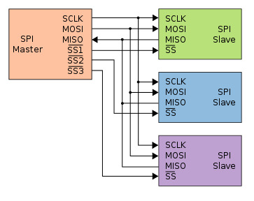

# SoC计算机系统
将NPC接入到ysyxSoC. 

SoC不仅仅只包含一个处理器, 还有诸多的外围设备, 以及连接处理器和外围设备之间的总线. 在这里, 我们把存储器也看成一种广义的设备, 毕竟对于SoC来说, 存储器和其他狭义的设备没有区别, 都是一段可以访问的地址空间

ysyxSoC文档: [ysyxSoC](./ysyxSoC.md)

## 获取ysyxSoC的代码并生成Verilog代码
### 初始操作
获取ysyxSoC的代码:
```sh
git clone git@github.com:OSCPU/ysyxSoC.git
cd ysyxSoC
```

在 `ysyxSoC` 目录下根据 mill 的文档介绍安装 java 与 mill (此外, rocket-chip项目要求mill的版本不低于0.11, 亲测0.12.1不行):

```sh
sudo apt install openjdk-8-jdk
curl -L https://github.com/com-lihaoyi/mill/releases/download/0.11.12/0.11.12 > mill && chmod +x mill
```

通过 `./mill --version` 可以查看版本

修改 `ysyxSoC/Makefile` 中的可执行文件为 `ysyxSoC` 目录下的 mill (`mill` 改为 `./mill`)

在 `ysyxSoC`目录下运行 `make dev-init` 命令, 拉取 `rocket-chip` 项目

在 `ysyxSoC/` 目录下运行 `make verilog`, 生成的Verilog文件位于 `ysyxSoC/build/ysyxSoCFull.v`

### 后续
进入 `ysyxSoC` 目录运行 `make verilog`


## 接入ysyxSoC
- 依照 [ysyxSoC/spec/cpu-interface.md](../../ysyxSoC/spec/cpu-interface.md) 中的master总线, 将之前实现的AXI4-Lite协议扩展到完整的AXI4
- 调整NPC顶层接口, 使其与 [ysyxSoC/spec/cpu-interface.md](../../ysyxSoC/spec/cpu-interface.md) 中的接口命名规范完全一致, 包括信号方向, 命名和数据位宽
  - 对于不使用的顶层输出端口, 需要将其赋值为常数0
  - 对于不使用的顶层输入端口, 悬空即可
  - 由于core有两个master，需要自己实现一层 axim, 作为仲裁逻辑，同时挂载clint与ysyxSoCFull模块作为slave
- 将 `ysyxSoC/perip` 目录及其子目录下的所有 `.v` 文件加入verilator的Verilog文件列表
- 将 `ysyxSoC/perip/uart16550/rtl` 和 `ysyxSoC/perip/spi/rtl` 两个目录加入verilator的include搜索路径中: 事实上只需要加入两个宏定义文件
- 在verilator编译选项中添加 `--timescale "1ns/1ns"` 和 `--no-timing`
- 将ysyxSoCFull模块(在 `ysyxSoC/build/ysyxSoCFull.v` 中定义)设置为verilator仿真的顶层模块
- 将 `ysyxSoCFull.v` 中的 `ysyx_00000000` 模块名修改为处理器的模块名 `cpu_wrapper`
- 在仿真的cpp文件中加入如下内容, 用于解决链接时找不到`flash_read`和`mrom_read`的问题:
```c
extern "C" void flash_read(int32_t addr, int32_t *data) { assert(0); }
extern "C" void mrom_read(int32_t addr, int32_t *data) { assert(0); }
```
- 开始仿真, 观察到代码进入了仿真的主循环, 但NPC无有效输出

## 最简单的SoC
### 程序的存放
使用一种非易失存储器(non-volatile memory)来存放最初的程序, 使其内容能在断电时保持, 并在上电时能让CPU马上从中取出指令. 一个最简单的解决方案就是ROM(Read-Only Memory), 每次从ROM中相同位置读出的内容都是相同的

ROM的实现有很多种, 总体上都是通过某种方式来将信息(在这里也是程序)存储在ROM中, 而且这种存储方式不会受到断电的影响, 从而具备非易失的属性. 如果考虑在ysyxSoC中的易用性, 最合适的就是mask ROM(掩膜ROM), 简称MROM, 其本质是将信息"硬编码"在门电路中, 因此对NPC来说访问方式非常直接

不过因为MROM的某些问题, 我们并不打算在流片的时候使用它. 但MROM作为ysyxSoC中的第一个简单的非易失存储器来存放程序, 对我们测试ysyxSoC的接入还是非常合适的. 我们已经在ysyxSoC中添加了一个AXI4接口的MROM控制器, 其地址空间是`0x2000_0000~0x2000_0fff`

#### 测试MROM的访问
修改NPC:
- NPC的复位PC值改为 `32'h20000000`
- 修改`mrom_read()`函数，使其总是返回一条ebreak指令`0x100073u`
- **由于 ysyxSoCFull.v 中的复位为高电平有效，需要把仿真环境中的 reset 修改为高电平复位，并反相后传给 cpu_wrapper**
- NPC取到的第一条指令即是ebreak指令, 从而结束仿真

因为NEMU还没有添加MROM的支持, 而NPC此时需要从MROM中取指, 故此时DiffTest机制不能正确工作. 不过目前的测试程序规模还很小, 可以先关闭DiffTest功能, 后面再回过头来处理DiffTest的问题

### 输出第一个字符
可以存放程序之后就需要考虑如何输出了. 为此, SoC中还需要提供一个最基本的输出设备. 真实的SoC中通常使用UART16550, 它包含一些设备寄存器, 用于设置字符长度, 波特率等信息. 在发送队列未满时, 即可通过写入对应的设备寄存器来发送字符

ysyxSoC中已经集成了一个UART16550控制器. 为了测试它, 我们先编写一个最简单的程序`char-test`, 它直接输出一个字符之后就陷入死循环:

```c
#define UART_BASE 0x10000000L
#define UART_TX   0

void _start() {
    *(volatile char *)(UART_BASE + UART_TX) = 'A';
    *(volatile char *)(UART_BASE + UART_TX) = '\n';
    while (1);
}
```

- 根据ysyxSoC中的设备地址空间约定, 以及UART手册(在 `ysyxSoC/perip/` 下的相关子目录中)中输出寄存器的地址设置上述宏定义, 使代码可以正确访问输出寄存器来输出一个字符
- 通过gcc和objcopy命令编译char-test, 并将ELF文件中的代码节单独抽取到char-test.bin中：
  - 使用 gcc 编译 char-test.c 文件生成目标文件: `riscv64-linux-gnu-gcc -fomit-frame-pointer -march=rv32e_zicsr -mabi=ilp32e -c -o char-test.o char-test.c`
  - 用 objcopy 命令从目标文件中抽取代码节到 char-test.bin 文件 `riscv64-linux-gnu-objcopy --dump-section .text=char-test.bin char-test.o`
- 改仿真环境的相关代码, 读入 `char-test.bin` 并将其作为MROM的内容, 然后正确实现 `mrom_read()` 函数, 使其根据参数addr返回MROM中相应位置的内容
- 修改 `$NPC_HOME/Makefile`，读取 bin 文件
- 实现正确后仿真过程将会在终端输出一个字符 `A`

如果通过 `riscv64-linux-gnu-objdump -S char-test.o` 等工具查看生成的汇编, 会发现代码节的地址位于地址0附近, 与MROM的地址空间不一致. 实际上, 这个程序很小, 我们很容易确认, 无论将它放在哪个地址, 都能正确地按预期执行. 对于更复杂的程序, 上述条件不一定能满足, 我们需要显式地将程序链接到一个正确的位置, 使得NPC复位后可以正确地执行程序

此外, 在真实的硬件场景下, 串口还需要根据波特率来将字符转换成串行的输出信号, 通过线缆传送到串口的接收端, 因此发送端在发送字符前, 软件还需要在串口的配置寄存器中设置正确的除数. 但当前的ysyxSoC仿真环境中并没有串口的接收端, 因此我们在串口控制器的RTL代码中添加了若干打印语句, 直接将串口发送队列中的字符打印出来, 这样软件也无需设置除数. 也因此, 上述代码在真实的硬件场景中并不一定能正常工作, 但作为前期测试, 这可以方便我们快速检查字符是否被正确写入串口发送队列. 我们将在成功运行足够多程序后, 再添加除数的设置, 使得代码可以在真实的硬件场景中工作

### 去掉换行也能输出
上述char-test在输出字符 `A` 之后, 还输出一个换行符. 尝试仅仅输出字符 `A` 而不输出换行符, 会观察到仿真过程连字符A都不输出了. 但如果每次输出一个字符之后都紧接着输出一个换行符, 打印出的信息将很难阅读.

为了解决这个问题, 只需要给verilator传递一个选项 `--autoflush`. 添加后将会看到即使上述程序仅输出单个字符 `A`, 也能成功输出. 选项描述如下:

After every `$display` or `$fdisplay`, flush the output stream. This ensures that messages will appear immediately but may reduce performance. For best performance, call fflush(stdout) occasionally in the C++ main loop. Defaults to off, which will buffer output as provided by the normal C/C++ standard library IO.

## 更实用的SoC
MROM虽然可以很好地实现程序的存放, 但它不支持写入操作. 但大多数程序都需要向存储器写入数据, 例如, C语言的调用约定允许被调用函数在栈上创建栈桢, 并通过栈桢存取数据. 因此, 一个仅包含MROM作为存储器的SoC可能无法支持那些需要调用函数的程序, 显然这并不实用. 为了支持写入操作, 我们需要添加RAM作为存储器, 并将程序的数据分配在RAM中

最简单的RAM就是我们之前提到的SRAM, 我们可以在SoC中集成SRAM存储器. SRAM能够使用与处理器制造相同的工艺进行生产, 同时读写延迟只有1周期, 因此速度很快. 但SRAM的存储密度较低, 需要占用一定的芯片面积, 因此从流片价格的角度来计算, 成本是十分昂贵的. 考虑到流片成本, 我们只在SoC中提供8KB的SRAM. 我们已经在ysyxSoC中添加了一个AXI4接口的SRAM控制器, 其地址空间是`0x0f00_0000~0x0f00_1fff`. 注意到在前文的介绍中, SRAM的地址空间是`0x0f00_0000~0x0fff_ffff`, 共16MB, 这只是说明ysyxSoC中给SRAM预留了16MB的地址空间, 但考虑到实际的成本, 只使用了其中的8KB, 剩余的地址空间是空闲的, NPC不应该访问这部分空闲的地址空间.有了这部分SRAM的空间, 我们就可以考虑将栈分配在SRAM空间, 从而支持一些AM程序的执行了

### 为ysyxSoC添加AM运行时环境
添加一个 `riscv32e-ysyxsoc` 的新AM, 并提供TRM的API:

- 添加 ysyxsoc 专用的链接脚本 `$AM_HOME/scripts/ysyxsoc_linker.ld`, 在其中分配堆栈，需要分配在可写的内存区间, 因此可以分配在SRAM中, 地址为0x0f000000~0x0f001fff, 栈从高地址向低地址生长，堆从低到高
- 在 `$AM_HOME/scripts/platform/ysyxsoc.mk` 中添加编译运行规则
- 在 `$AM_HOME/scripts/risc32e-ysyxsoc.mk` 中补充规则
- `main()`函数由AM上的程序提供, 但我们需要考虑整个运行时环境的入口, 即需要将程序链接到MROM的地址空间, 并保证TRM的第一条指令与NPC复位后的PC值一致, 需要修改  `$AM_HOME/scripts/platform/ysyxsoc.mk` 中的 `_pmem_start`
- 退出程序使用 `halt()` 提供 ebreak 指令
- `putch` 可通过ysyxSoC中的UART16550进行输出
- 由于NPC复位后从MROM开始执行, 而MROM不支持写入操作, 因此我们需要额外注意: 程序中不能包含对全局变量的写入操作; 栈区需要分配在可写的SRAM中

添加后, 将cpu-tests中的dummy测试编译到riscv32e-ysyxsoc, 并在ysyxSoC的仿真环境中运行它

### 无法运行的测试 
在ysyxSoC中运行cpu-tests中的fib, 发现运行失败, 报错对MROM进行了写操作, 应该是对全局变量fib数组元素的写操作

### 重新添加DiffTest (tbc)
由于下一阶段都会在MROM和SRAM上运行程序, 但NEMU并没有MROM和SRAM, 如果我们在DiffTest的时候跳过MROM和SRAM和访问, 将会跳过所有指令的执行, 使得DiffTest将无法起到预期的作用

为了重新添加DiffTest, 需要在NEMU中添加MROM和SRAM, 并在NPC的仿真环境初始化DiffTest时, 将MROM中的内容同步到NEMU中, 然后检查在MROM中执行的每一条指令
- 尽量不添加新的DiffTest API, 框架代码提供的DiffTest API已经足够实现上述功能

### 让NPC抛出Access Fault异常 (tbc)


### 内存访问测试
可以执行dummy测试后, 我们认为NPC基本上能成功访问ysyxSoC的SRAM了. 我们知道, 访存是程序运行的基础. 为了对访存行为进行更充分的测试, 我们需要编写一个程序mem-test来测试更大范围的内存.

从范围上看, mem-test希望能测试所有可写内存区域. 但mem-test本身的运行需要栈区的支持, 而栈区需要分配在可写内存区域, 因此在测试时需要绕开栈区, 避免栈区内容被覆盖, 导致mem-test本身运行出错. 我们可以把栈区放在SRAM的末尾, 并把堆区的起始地址设置在SRAM的开始, 堆区的结束地址设置在栈区的起始地址(即栈顶的初值). 设置好堆区的范围之后, 就可以把堆区作为mem-test的测试范围.

从测试方式上看, 我们采用一种最直观的方式: 先往内存区间写入若干数据, 再读出并检查. 我们可以让写入的数据与内存的地址相关, 从而方便检查, 例如data = addr & len_mask. 以下示意图展示了通过8位, 16位, 32位, 64位的写入地址和地址之间的关系.

```
    SRAM_BASE                                    SRAM_BASE + 0x10
        |                                               |
        V                                               V
        +--+--+--+--+--+--+--+--+--+--+--+--+--+--+--+--+
8-bit   |00|01|02|03|04|05|06|07|08|09|0a|0b|0c|0d|0e|0f|
        +--+--+--+--+--+--+--+--+--+--+--+--+--+--+--+--+
16-bit  |00|00|02|00|04|00|06|00|08|00|0a|00|0c|00|0e|00|
        +--+--+--+--+--+--+--+--+--+--+--+--+--+--+--+--+
32-bit  |00|00|00|0f|04|00|00|0f|08|00|00|0f|0c|00|00|0f|
        +--+--+--+--+--+--+--+--+--+--+--+--+--+--+--+--+
64-bit  |00|00|00|0f|00|00|00|00|08|00|00|0f|00|00|00|00|
        +--+--+--+--+--+--+--+--+--+--+--+--+--+--+--+--+
```

在am-kernels中编写一个新的程序 [mem-test](../../am-kernels/tests/mem-tests/mem_test.c), 完成上述内存测试功能. 如果检查数据时发现不一致, 就通过`halt()`结束mem-test的运行:

- 目前程序的全局变量分配在MROM中, 因此程序不能包含对全局变量的写入操作
- `printf()`的代码较复杂, 调用`printf()`可能会使程序大小超过MROM空间, 而且其中还包含不少访存操作, 甚至有可能包含对全局变量的写入, 因此目前不通过`printf()`打印信息, 不过trace和波形足够帮助排除bug
- 为了避免编译优化带来的影响, 使用 volatile 关键词

### 支持全局变量的写入操作
很多程序都会写入全局变量, 因此我们还需要寻找一个解决方案来支持全局变量的写入操作(由于全局变量位于数据段中, 为了方便叙述, 下文用"数据段"来代替"全局变量")

一个直接的想法是, 既然MROM不支持写操作, 我们就把数据段分配在SRAM中. 但在系统启动时, SRAM中并不包含有效的数据, 因此只能把数据段放到MROM中, 才能在系统启动时访问. 为了解决这个问题, 我们可以在程序真正开始执行前, 将数据段从MROM加载到SRAM中, 并让接下来的代码访问加载到SRAM中的数据段, 通过SRAM的可写特性支持全局变量的写入操作. 事实上, 真实的操作系统也需要把程序加载到存储器中运行, 其中还需要进行很多复杂的操作. 因此执行上述加载操作的代码也可以看成一个加载器, 只不过目前其功能还很简单, 它只负责将程序的数据段从MROM加载到SRAM. 但由于这个加载器的工作时刻是在系统启动时, 因此我们将其称为bootloader, 主要实现三点:

#### 得到数据段在MROM中的地址MA(mrom address)以及数据段的长度LEN
- 在链接脚本的数据段开始前定义一个符号, 即可在运行时刻让bootloader获得该符号的地址, 即MA
- 在链接脚本的数据段结束后定义一个符号, 与上述符号相减即可得到长度LEN

#### 得到数据段在SRAM中的地址SA(sram address), 让程序代码通过SA访问数据段
一方面, 由于SA是一个地址, 而程序中的地址需要在链接中的重定位阶段才能确定, 因此SA最早也要在链接阶段才能确定. 另一方面, 由于第3点要求后续代码需要通过SA访问数据段, 而运行时刻的bootloader很难修改相应指令中的访问地址, 因此SA必须在运行前确定. 综合考虑上述两点, 我们可以得出结论: SA只能在链接阶段确定, 我们需要在链接脚本中定义SA

为此, 我们需要用到链接脚本中的两种符号地址. 一种是虚拟内存地址(virtual memory address, VMA), 它表示程序运行时对象所在的地址; 另一种是加载内存地址(load memory address, LMA), 它表示程序运行前对象所在的地址. 通常情况下, 这两种地址相同. 但在上述需求中, 这两种地址有所不同: 数据段存放在MROM中, 但需要让程序代码访问加载到SRAM中的数据段, 即MA是LMA, SA是VMA

首先, 我们需要定义两种存储器区间:

```
MEMORY {
  mrom : ORIGIN = 0x20000000, LENGTH = 4K
  sram : ORIGIN = 0x0f000000, LENGTH = 8K
}
```

然后在描述节和段的映射关系时, 显式地说明段的VMA和LMA, 例如其中`>`后表示VMA在的存储器区间, `AT>`后表示LMA所在的存储器区间. 上述链接脚本表示, 代码段将链接到MROM空间, 同时也位于MROM空间

```
SECTIONS {
  . = ORIGIN(mrom);
  .text : {
      /* ... */
  } > mrom AT> mrom
  /* ... */
}
```

可以通过 `--print-map` 选项查看 `ld` 如何进行链接

#### 将数据段从MA复制到SA
- 只需要在程序运行前调用 `memcpy()`
- 具体实现上, 在 ysyxsoc 的 `trm.c` 中新增一个 `bootloader()` 函数，使用指针加载数据、为未初始化数据赋0

实现后能成功运行 `cpu-tests` 中除 `string` 外的所有测试 (update: `string` 不能运行是因为ld script没有正确设置bss段的内存映射, 已解决)

### 通过串口输出

#### 实现 `putch()`
通过向UART16550写入字符, 实现 `putch()` 的功能. 实现后运行hello程序, 可以看到NPC输出若干字符，**不过NPC并没有输出全部字符**

导致上述问题的原因是软件没有对串口初始化, 串口的发送功能并没有工作, 因此写入串口的字符一直占用串口的发送队列, 队列满后就无法写入更多字符

#### 正确实现串口的初始化
事实上, 在往串口输出字符之前, 软件需要进行以下初始化:
- 设置串口收发参数, 具体包括波特率, 字符长度, 是否带校验位, 停止位的位宽等. 波特率指每秒传送的字符数. 不过通常并非直接在寄存器中设置波特率, 而是设置一个与波特率成反比的除数: 除数越小, 波特率越大, 传输速率越快, 但受电气特性的影响, 误码率也越高, 字符传送成功的概率越低; 相反, 除数越大, 波特率越小, 传输速率越慢, 软件等待的时间也越长. 除数的值还与串口控制器的工作频率有关, 后者即串口每秒传送的比特数
- 串口收发端的参数配置要完全一致, 才能正确发送和接收字符. 通常用形如 115200 8N1 等方式来描述一组参数配置, 它表示波特率是115200, 字符长度是8位, 不带校验位, 1位停止位.
- 按需设置中断, 不过NPC目前不支持中断, 因此可不设置
- 需要在TRM中添加代码(本质就是读写memory-mapped registers), 设置串口的除数寄存器. 由于ysyxSoC本质上还是一个仿真环境, 没有串口接收端, 也没有电气特性的概念, 因此目前可随意设置上述除数, 不必担心误码率的问题; 具体的初始化过程可以参考 [UART_spec.pdf](../../ysyxSoC/perip/uart16550/doc/UART_spec.pdf)
- uart 的 rtl 也需要修改，使用 in_pstrb 与 in_paddr 得到 3 位的寄存器地址 (update: 注意这是写地址, 读地址不需要修改)
- hello 程序多输出了一些字符, 但仍然会出现字符丢失的情况

#### 输出前轮询串口的状态寄存器
- 修改 `putch()` 的代码, 在输出前先查询串口发送队列的情况
- 参考手册，只需要读出 LSR 寄存器的第 6 位即可
- 修改完后串口能正常工作/

修改完后TRM就可以运行更多程序了. 不过目前程序的规模还是受限于MROM和SRAM的大小. 受制造工艺的影响, 如果要在成本可接受的情况下使用更大的存储器, 我们就需要使用一些更慢的存储器

### 可重复编程的非易失存储器
首先解决程序存放的问题. MROM除了成本高之外, 另一个缺点就是可编程性很弱. 事实上, MROM只支持制造时编程, 即MROM的内容是在RTL设计时决定的, 经过后端物理设计后, 晶圆厂将根据版图制作用于光刻的掩膜(mask), 然后用这个掩膜来制造芯片, 这也是mask ROM中mask的含义. 但在芯片制造完成后, MROM中存储的内容无法进行更改. 如果要通过重新流片的方式来更换芯片运行的程序, 代价是不可接受的.

随着存储技术的发展, 人们发明了可重复编程和擦除的ROM, 目前广泛使用的flash存储器就是其中一种. 用户能够在某些条件下擦除flash存储器中存放的内容, 并重新进行写入. 通常来说, 用户只需要购买一个数十元的烧录器, 即可通过烧录软件更新flash中的内容. 通过这种方式, 更换flash中存放的程序的代价变得可以接受.

U盘的本质就是一块USB接口的flash存储器, 外加一个MCU. 如今操作系统都内置USB协议的flash驱动程序, 因此用户只需要将U盘插入计算机, 即可往其中写入数据. 不过这对当前的NPC来说有点复杂了, 不仅需要配备一个USB控制器, 还需要运行相应的驱动程序才能完成烧录操作, 因此还是采用烧录器的方案

#### RTFSC理解从flash中读出数据的过程
ysyxSoC包含了flash控制器, 并且将flash存储空间映射到CPU的地址空`0x3000_0000~0x3fff_ffff`. 可以先在`ysyxSoC/perip/spi/rtl/spi_top_apb.v`中定义宏`FAST_FLASH`, 然后尝试结合代码理解flash读过程. 至于flash的写入, 由于flash的写入需要先擦除一整个扇区, 再重新写入整片的数据, 因此需要向flash颗粒发送多次命令. 不过当前我们只是期望用flash替代MROM, 使得NPC在复位时能从flash中取出有效的指令, 因此我们暂时不会对flash颗粒进行写操作, ysyxSoc的flash颗粒代码中也仅支持读操作

#### 从flash中读出数据
接下来就可以通过代码测试这一过程了:
- 在仿真环境中定义一个代表flash存储空间的数组
- 在仿真环境初始化时, 往上述数组写入若干内容, 此操作可以看作是模拟了往flash颗粒中烧录数据的过程
- 正确实现`flash_read()`函数, 使其根据参数addr返回flash中相应位置的内容
- 在am-kernels中编写一个简单的测试程序(见 [fast_flash_test.c](../../am-kernels/kernels/fast_flash_test/fast_flash_test.c)), 从flash存储空间中读出内容, 并检查是否与仿真环境初始化时设置的内容一致

#### 通过SPI总线协议访问flash颗粒
以上文提到的读命令为例, 一次读操作至少涉及8位的命令, 24位的地址, 以及8位的数据, 这就已经占用40比特的信号了. 因此把这些信号全部通过引脚通到flash颗粒外部, 并不是一个好的方案. 为了降低flash颗粒的引脚数量, 一般会在flash颗粒中添加一个SPI总线接口. SPI的全称是Serial Peripheral Interface, 是一种串行总线协议, 通过少数几根信号线在master和slave之间进行通信



SPI总线总共只有4种信号:

- `SCK` : master发出的时钟信号, 只有1位
- `SS` : slave select, master发出的选择信号, 用于指定通信对象, 每个slave对应1位
- `MOSI` : master output slave input, master向slave通信的数据线, 只有1位
- `MISO` : master input slave output, slave向master通信的数据线, 只有1位

为了基于SPI总线进行通信, master通常先通过SS信号选择目标slave, 然后通过SCK信号向slave发出SPI的时钟脉冲, 同时将需要发送的信息转化成串行信号, 逐个比特通过MOSI信号传输给slave; 然后监听MISO信号, 并将通过MISO接收到的串行信号转化成并行信息, 从而获得slave的回复. slave的工作方式是类似的, 如果slave在SS信号有效的情况下收到SCK时钟脉冲, 则监听MOSI信号, 并将通过MOSI接收到的串行信号转化成并行信息, 从而获得master的传来的命令; 处理完命令后, 将需要回复的信息转化成串行信号, 逐个比特通过MISO信号传输给master.

可以看到, 除了状态机之外, 实现SPI总线协议的核心就是串行/并行信号之间的转换, 具体来说就是发送方如何将信号发送出去, 以及接收方如何采样并接收信号. 一方面需要考虑发送的尾端(endianness): 是从高位到低位发送, 还是从低位到高位发送; 另一方面需要考虑发送和采样的时机(时钟相位, clock phase): 是在SCK上升沿时发送/采样, 还是在SCK下降沿时发送/采样. 有时还会约定时钟空闲时的电平(时钟极性, clock polarity): 是高电平空闲还是低电平空闲. 在发送和采样的过程中, SCK起到了同步的作用, 双方共同约定发送/采样的尾端和时机, 并在RTL层次正确地实现约定. 在真实场景中, 不同的slave可能有不同的约定, 这意味着在与不同slave通信的时候, master需要配合slave的约定来进行发送和采样.

不过, 上层软件并不希望关心这些信号层次的行为, 因此SPI master还需要将这些信号层次的行为抽象成设备寄存器, 上层软件只要访问这些设备寄存器, 就可以查询或控制SPI master. 事实上, 在总线架构中, SPI master有两重身份, 它一方面是AXI(或其他AMBA协议, 如APB)的slave, 负责接收来自CPU的命令, 另一方面又是SPI的master, 负责给SPI的slave发送命令. 因此我们也可以将SPI master看成是AXI和SPI之间的一个桥接模块, 用于将AXI请求转换成SPI请求, 从而与SPI的slave进行通信.

ysyxSoC集成了SPI master的实现, 并将其设备寄存器映射到CPU的地址空间`0x1000_1000~0x1000_1fff`, 相关代码和手册在`ysyxSoC/perip/spi/`下的相应子目录中. 有了设备寄存器的抽象, 我们就可以梳理上层软件的行为了. 为了与不同的slave通信, master一般需要支持多种约定, 具体设置成哪一种约定, 是通过配置设备寄存器来实现的. SPI驱动程序在与slave通信之前, 先设置SS寄存器来选择目标slave, 并按照slave的约定配置SPI master的控制寄存器, 然后再将需要传输的数据写入发送数据寄存器, 最后往某控制寄存器写入表示"开始传输"的命令. SPI驱动程序可以轮询SPI master的状态寄存器, 当状态标志为"忙碌"时则等待, 直到状态标志为"空闲"为止, 此时可从接收数据寄存器中读出slave的回复.

#### 实现基于SPI协议的位翻转模块
为了熟悉并测试SPI的基本流程, 我们来编写一个简单的位翻转模块bitrev(在`ysyxSoC/perip/bitrev/bitrev.v`中实现相应代码). 该模块接收一个8位的数据, 然后输出该数据的位翻转结果, 也即, 将输入数据的第0位与第7位交换, 第1位与第6位交换... 参考波形:

```
                +---+   +---+   +---+   +---+   +---+   +---+   +---+   +---+   +---+   +---+   +---+   +---+   +---+   +---+   +---+   +---+
 SCK            |   |   |   |   |   |   |   |   |   |   |   |   |   |   |   |   |   |   |   |   |   |   |   |   |   |   |   |   |   |   |   |
        --------+   +---+   +---+   +---+   +---+   +---+   +---+   +---+   +---+   +---+   +---+   +---+   +---+   +---+   +---+   +---+   +------------
        --------+                                                                                                                               +--------
 SS             |                                                                                                                               |
                +-------------------------------------------------------------------------------------------------------------------------------+
        +-------+-------+-------+-------+-------+-------+-------+-------+-------+------------------------------------------------------------------------
MOSI            |   b7  |   b6  |   b5  |   b4  |   b3  |   b2  |   b1  |   b0  |
                +-------+-------+-------+-------+-------+-------+-------+-------+
        +-----------------------------------------------------------------------+-------+-------+-------+-------+-------+-------+-------+-------+--------
MISO                                                                            |   b0  |   b1  |   b2  |   b3  |   b4  |   b5  |   b6  |   b7  |
                                                                                +-------+-------+-------+-------+-------+-------+-------+-------+
```

- 取消`ysyxSoC/perip/spi/rtl/spi_top_apb.v`中定义的宏`FAST_FLASH`, 使得APB请求可以访问SPI master的设备寄存器
- SPI master输出的`SS`信号是低电平有效的, 而且要求slave空闲时, 将MISO信号设置为高电平
- 由于SCK只在SPI传输过程中产生脉冲且bitrev模块并不参与流片, 使用 `initial` 语句进行初始化

在硬件上实现bitrev模块后还需要编写一个程序来测试. 编写AM程序 [api_bitrev.c](../../am-kernels/kernels/spi_bitrev/spi_bitrev.c), 通过驱动SPI master往bitrev模块中输入一个8位数据, 然后读出其处理后的结果, 检查结果是否符合预期:
- 将需要发送的数据设置到SPI master的TX寄存器中
- 设置除数寄存器, 它用于指示SPI master传送时SCK频率与当前SPI master时钟频率的比例. 由于verilator中没有频率的概念, 因此可以设置一个使得SCK频率尽量高的除数. 在真实芯片中, SCK频率过高可能会导致slave无法正确工作, 因此除数寄存器的设置需要符合slave工作频率的要求
- 设置SS寄存器, 选择bitrev模块作为slave, ysyxSoC已经将bitrev作为一个SPI slave与SPI master相连, 其slave编号为7
- 设置控制寄存器(每一个字段):
    - `CHAR_LEN` : 由于输入数据和输出数据的长度均为8位, 因此传输长度应为16位
    - `Rx_NEG`, `Tx_NEG`和`LSB` : 都采用上升沿采样, 设置为先传输也先接收LSB, 因此按手册三位设置为 3'b100
    - `IE` : 目前不使用中断功能, 设置为0
    - `ASS` : 设置为0, ss信号由ss寄存器生成
- 轮询控制寄存器中的完成标志, 直到SPI master完成数据传输
- 从SPI master的RX寄存器中读出slave返回的数据 (注意在16位的高8位)
- 发送倒序的 `s` 和 `@` 字符, 返回之后使用 uart 输出对比

#### 通过SPI总线从flash中读出数据
编写AM程序 [spi_flash_test.c](../../am-kernels/kernels/spi_flash_test/spi_flash_test.c), 在其中实现一个原型为 `uint32_t flash_read(uint32_t addr)` 的函数, 注意这个`flash_read()`函数和上文中提到的同名的DPI-C接口函数不同. 此处的`flash_read()`函数通过驱动SPI master, 读出flash颗粒中起始地址为addr的32位内容. 这个过程和上文的bitrev例子类似:

- 将需要发送给flash颗粒的命令设置到SPI master的TX寄存器中, 用到了`TX0`和`TX1`两个寄存器, 先发送`0x03`的读命令，再发送24位地址，共32位，注意先发送MSB
- 设置除数寄存器
- 设置SS寄存器, 选择flash颗粒作为slave, 其slave编号为0
- 设置控制寄存器:
    - `CHAR_LEN` : 由于读命令的长度共32位, 且需要读出32位数据, 因此传输长度应为64位
    - `Rx_NEG`和`Tx_NEG` : 默认值
    - `LSB` : rtfsc，观察flash代码, 需要设置为1
    - `IE` : 目前我们不使用中断功能
    - `ASS` : 设置为0
- 轮询控制寄存器中的完成标志, 直到SPI master完成数据传输
- 从SPI master的RX寄存器中读出slave返回的数据，返回的数据位于`RX0`寄存器
- 实现`flash_read()`后, 通过该函数从flash存储空间中读出内容, 检查与仿真环境初始化时设置的内容一致

#### 从flash中加载程序并执行
- 将上文提到的`char-test`程序存放到flash颗粒中: 使用`objdump`得到机器码，在仿真环境中写入flash颗粒
- 在 [spi_read_inst.c](../../am-kernels/kernels/spi_read_inst/spi_read_inst.c) 中通过`flash_read()`将char-test从flash读入到SRAM的指定地址中, 然后使用内联汇编跳转到该地址执行`char-test`
- spi的除数寄存器设置为 `0x00000004`，大幅提高传输效率
- spi传输完成后需要把 ss 寄存器复位，否则不能正确进行下次传输
- 实现后 `make ARCH=riscv32e-ysyxsoc run` 正确执行 `char-tests`

### 从flash中取指
以上尝试通过软件函数来实现硬件上的取指操作, 这并不合理, 因为取指操作是一个硬件层次的行为. 因此, 我们应该尝试在硬件层次实现"从flash中取指"的功能

要在硬件层次实现`flash_read()`的功能, 也就是要按照一定的顺序在硬件上访问SPI master的寄存器: 那就是用状态机实现`flash_read()`的功能! 与上文从flash中加载程序并执行的方式不同, 这种从flash颗粒中取指的方式并不需要在执行程序之前将程序读入到内存(对应上文的SRAM)中, 因此也称"就地执行"(XIP, eXecute In Place)方式

为了区分正常访问SPI master的情况, 我们需要将通过XIP方式访问 flash 的功能映射到与SPI master设备寄存器不同的地址空间. 事实上, 我们可以对之前访问的flash存储空间`0x3000_0000~0x3fff_ffff`稍作调整, 将其定义为通过XIP方式访问的flash存储空间. ysyxSoC中的Xbar已经将SPI master的地址空间 `0x1000_1000~0x1000_1fff` 和 flash 存储空间 `0x3000_0000~0x3fff_ffff` 都映射到 `ysyxSoC/perip/spi/rtl/spi_top_apb.v` 模块中的APB端口, 也即 `spi_top_apb.v` 模块中的APB端口能接收上述两段地址空间的请求, 可以通过检查APB的目标地址区分它们

#### 通过XIP方式访问flash
实现XIP方式的过程如下:

- 检查APB请求的目标地址, 若目标地址落在SPI master的地址空间, 则正常访问并回复
- 若目标地址落在flash存储空间, 则进入XIP模式. 在XIP模式中, SPI master的输入信号由相应状态机决定
    - 状态机依次往SPI master的设备寄存器中写入相应的值, 写入的值与`flash_read()`基本一致
    - 状态机轮询SPI master的完成标志, 等待SPI master完成数据传输
    - 状态机从SPI master的RX寄存器中读出flash返回的数据, 处理后通过APB返回, 并退出XIP模式
    - 具体地, 在`ysyxSoC/perip/spi/rtl/spi_top_apb.v`中实现相应代码

在通过XIP方式取指之前, 先测试是否能通过XIP方式完成CPU发出的读请求. 在[spi_flash_test.c](../../am-kernels/kernels/spi_flash_test/spi_flash_test.c)中增加测试程序, 直接通过指针从flash存储空间中读出内容 看到与仿真环境初始化时设置的内容一致.

目前我们不考虑通过XIP方式支持flash的写入操作

#### 通过XIP方式执行flash中的程序
将上文提到的 `char-test` 程序存放到flash颗粒中, 编写测试程序, 跳转到flash中执行 `char-test`: 修改 `spi_read_inst` 测试, 在 [spi_read_inst_xip.c](../../am-kernels/kernels/spi_read_inst_xip/spi_read_inst_xip.c) 中实现直接取指，测试通过

#### 用flash替代MROM
确认可以从flash中取指执行后, 我们就可以用flash完全替代MROM来存放第一个程序了: 
- 修改PC的复位值为 `0x30000000`, 使NPC复位后从flash中取出第一条指令
- 修改仿真环境，把程序加载,使得 `flash_read()` 从 pmem 中取数据(即指令)
- 修改编译脚本，把 mrom 的地址空间修改为 flash
- 修改 [ysyxSoCFull.v](../../npc/vsrc/ysyxSoCFull.v), disable 了 cpu_reset_chain 给出的 `_cpu_reset_chain_io_q`, 否则会出现重复取指

因为flash的大小比之前使用的MROM大得多, 因此可以存放并执行更大的程序了 (coremark等包含`printf()`的程序): 
- 为了减少coremark的运行时间, 可以 rtfsc , 发现可以指定 ITERATION
- 评估现在的实现，以dummy为例，一条指令的生命周期(从取指请求到retire)长达300个周期，是不可接受的

#### 通过中断等待SPI master传输完成 (tbc)
我们的XIP实现是通过轮询的方式不断查询SPI master的传输是否完成, 事实上, SPI master还支持中断通知模式, 设置控制寄存器的IE位后, SPI master在传输结束后将会发出中断信号, XIP模式的状态机可以通过等待这个中断信号来等待SPI master传输完成. 尽管这不会带来显著的性能提升, 但在实际的系统中, 等待中断的实现可以节省能耗, 因为轮询方式发起的请求和回复并没有对系统的运行带来实际的贡献

### 存储密度更大的随机存储器
通过flash解决了MROM只能存放小程序的问题后, 我们还需要考虑数据的存放. 如果程序需要写入的数据过多, 超过SRAM能提供的8KB, 那这个程序还无法在ysyxSoC上运行. 为此, 我们需要一个更大的, 而且可以支持CPU执行store指令的存储器

#### PSRAM颗粒
有一类DRAM颗粒在内部集成了刷新的逻辑, 称为PSRAM(Pseudo Static Random Access Memory)颗粒. PSRAM控制器无需实现刷新的功能, 也无需关心PSRAM颗粒的内部结构, 因此这种颗粒使用起来与SRAM很类似: 只需给出地址, 数据和读写命令, 就可以访问颗粒中的数据. 一个例子是型号为IS66WVS4M8ALL的PSRAM颗粒, 它能提供4MB的存储空间, 更多信息可参考相关的手册.

有了PSRAM, 我们就可以尝试让ysyxSoC向程序提供更大的可写内存区间. 与通过SPI协议访问flash颗粒类似, PSRAM颗粒也提供了SPI接口. 不过, 和flash不同, PSRAM一般作为系统的内存, 因此有必要提供更高效的访问方式.

#### 通过SPI总线协议的升级版访问PSRAM颗粒
事实上, SPI协议存在一些升级版本, 可以提升master和slave间的通信效率. 基础的SPI协议是全双工的, 即master和slave可以同时分别通过`MOSI`和`MISO`发送消息. 但通常来说, master先向slave发送命令, slave在收到命令后才能处理, 然后才能把处理结果回复给master, 这个过程只需要半双工的信道即可满足

Dual SPI协议利用了这一点, 可以将基础SPI协议中的`MOSI`和`MISO`同时用于其中一个方向的传输, 也即, Dual SPI协议可以在一个SCK时钟内单向传输2 bit. 因为`MOSI`和`MISO`的含义发生了变化, 因此在Dual SPI协议中, 它们的名称分别改为`SIO0`(Serial I/O 0)和`SIO1`

为了与基础SPI协议的传输方式区别开来, slave通常会提供不同的命令来让master选择通过何种协议进行传输. 例如, 上文提到的型号为W25Q128JV的flash颗粒提供多种读命令:

- `03h`命令, 使用基础SPI协议进行读操作, 其命令, 地址, 数据都按`1 bit`传输. 通常把这三者的传输位宽用一个三元组(命令传输位宽-地址传输位宽-数据传输位宽)来表示, 例如, 基础SPI协议也记为`(1-1-1)`. 以读出32位数据为例, `03h`命令需要执行`8 + 24 + 32 = 64`个SCK时钟
- `3Bh`命令, 使用Dual SPI协议进行读操作, 其命令和地址按`1 bit`传输, 但数据按`2 bit`传输, 记为`(1-1-2)`. 以读出32位数据为例, `3Bh`命令需要执行`8 + 24 + 32/2 = 48`个SCK时钟, 不过无论数据按多少位进行传输, 从flash存储阵列上读出数据总是需要一定的延迟, 因此`3Bh`命令在传输数据之前还需要额外等待8个SCK时钟, 即`3Bh`命令需要执行`8 + 24 + 8(读延迟) + 32/2 = 56`个SCK时钟
- `BBh`命令, 使用Dual SPI协议进行读操作, 其命令按`1 bit`传输, 但地址和数据按`2 bit`传输, 记为`(1-2-2)`. 以读出32位数据为例, `BBh`命令需要执行`8 + 24/2 + 4(读延迟) + 32/2 = 40`个SCK时钟

进一步地, 还有Quad SPI协议(简称QSPI), 通过添加`SIO2`和`SIO3`两位新信号, 可以在一个SCK时钟内单向传输`4 bit`. 例如, 上文提到的型号为W25Q128JV的flash颗粒还提供另外两种基于QSPI协议的读命令:

- `6Bh`命令, 其命令和地址按`1 bit`传输, 但数据按`4 bit`传输, 记为`(1-1-4)`. 以读出32位数据为例, `6Bh`命令需要执行`8 + 24 + 8(读延迟) + 32/4 = 48`个SCK时钟
- `EBh`命令, 其命令按`1 bit`传输, 但地址和数据按`4 bit`传输, 记为`(1-4-4)`. 以读出32位数据为例, `EBh`命令需要执行`8 + 24/4 + 6(读延迟) + 32/4 = 28`个SCK时钟

不过, 上面的读命令中, 无论地址和数据部分按多少位进行传输, 命令部分都是按`1 bit`传输. 这是因为slave在解析出命令之后, 才知道后续的地址和数据应该使用何种协议进行传输, 因此命令部分仍然按照基础SPI协议来逐位进行传输. 此外, 虽然上述型号的flash颗粒支持多种传输方式, 但与flash颗粒相连的SPI master只能以基础SPI协议进行传输, 因此无法发出其他读命令.

ysyxSoC集成了PSRAM控制器的实现, 并将PSRAM存储空间映射到CPU的地址空间`0x8000_0000~0x9fff_ffff`. PSRAM控制器的代码位于`ysyxSoC/perip/psram/efabless/`目录下, 采用wishbone总线协议, 我们已经将其封装成APB总线协议 (见`ysyxSoC/perip/psram/psram_top_apb.v`), 并将其接入到ysyxSoC的APB Xbar中. PSRAM控制器会将接收到的总线事务翻译成发往PSRAM颗粒的命令. 我们选择模拟型号为IS66WVS4M8ALL的PSRAM颗粒, 它支持QSPI协议, 因此ysyxSoC集成的PSRAM控制器可以通过QSPI协议与PSRAM颗粒进行通信, 从而可以使用更高效的命令访问PSRAM. ysyxSoC已经将PSRAM颗粒与PSRAM控制器相连, 但未提供PSRAM颗粒相关的代码, 为了在ysyxSoC中使用PSRAM, 还需要实现PSRAM颗粒的仿真行为模型:

#### 实现PSRAM颗粒的仿真行为模型
实现IS66WVS4M8ALL颗粒的仿真行为模型. 你只需要实现SPI Mode的`Quad IO Read`和`Quad IO Write`两种命令即可, 它们的命令编码分别为`EBh`和`38h`, PSRAM控制器也只会向PSRAM颗粒发送这两种命令. 手册中还有一个QPI Mode, 其含义与上文提到的QSPI不同, 目前可忽略

- 在[perip/psram/psram.v](../../npc/vsrc/perip/psram/psram.v)中实现相应代码(作为qspi协议的slave, 可以参考flash的实现), 注意读需要wait, 写不需要. 还需要修改qspi的master, 发送地址时加入低两位的, 作为偏置供slave移位使用 
- 端口`ce_n`的含义与SPI总线协议中的`SS`相同, 低电平有效
- 端口`dio`声明为`inout`类型, 再配合一个用于输出使能信号, 可实现三态逻辑, 在同一时刻可用于输入或输出, 用于实现信号的半双工传输 (在ASIC流程中, 需要显式实例化标准单元库中的三态逻辑单元, 不过此处我们仅在仿真环境中测试, 因此无需调用标准单元库)
- 存储阵列只需要实现成一个字长为`8 bit`的二维数组, 无需关心其物理组织结构, 重点关注QSPI协议的实现即可. 此外, 因为PSRAM不是非易失存储器, 无需在仿真环境初始化时设置其内容, 通过DPI-C访问在C++代码中定义的数组psram, 从而方便被mtrace追踪
- 关于尾端和时钟相位等细节, 可RTFM参考相关手册, 或RTFSC参考PSRAM控制器的代码
- 为了正确实现PSRAM控制器和PSRAM颗粒的通信, 无需修改PSRAM控制器的代码 (反正我不流片，就改就改)
- 使用简单的case测试: [qspi_psram_test.c](../../am-kernels/kernels/qspi_psram_test/qspi_psram_test.c)

#### 实现支持QPI协议的PSRAM颗粒行为模型 (tbc)
在QSPI之上还有一种称为QPI的协议, 它还能进一步提升命令部分的传输效率, 即命令, 地址和数据都按`4 bit`传输, 记为`(4-4-4)`. 不过为了兼容旧的SPI master, slave上电时一般处于基础SPI模式, 此时通过基础SPI协议通信. 如果slave支持QPI协议, 它将提供一个切换到QPI模式的命令, master可以复位后发送该命令将slave切换到QPI模式, 然后使用QPI协议与其通信. 注意这个功能的添加对上层软件是透明的, 上层软件无需进行任何改动, 就能提升访问PSRAM的效率:

- rtfm 得到切换QPI模式的命令为 `0x35`
- 懒得修改psram控制器了, 直接让psram在复位时进入QPI模式 (当然用来流片肯定是不行的)
- 实现后, 通过`mem-test`测试一小段PSRAM的访问(如4KB), 检查实现是否正确. 注意到目前flash已经提供了更大的存储空间来存放程序, 因此你可以在mem-test中调用`printf()`来帮助你输出调试信息, 尤其是可以输出一些和测试进度相关的信息, 从而得知测试是否正常进行中

#### 运行更大的程序
有了PSRAM的支持, 我们就可以尝试把数据段分配在PSRAM, 从而支持运行更大的程序.

在ysyxSoC上运行microbench: 之前我们把数据段和堆区分配在8KB的SRAM中, 而运行microbench所需要的内存大于8KB, 因此有不少子项无法运行. 修改链接脚本, 将数据段和堆区分配在4MB的PSRAM, 栈区依然在8K的SRAM, microbench可以成功运行test规模的所有测试, 由于当前没有timer, 因此打印的时间没有价值

运行microbench只是从流程上说明把数据段分配在PSRAM并无大碍, 但是则需要花费很长的时间(当前dummy每条指令依然需要295个周期来完成, 延迟包括flash取指, spi分频, spi传输, XIP状态机).

由于循环和函数调用的存在, 程序中的大部分代码都要重复执行. 相比于让程序一直在flash中执行, 提前花一些时间将代码加载到一个访问效率比flash更高的存储器中, 然后让程序在后者中重复执行, 反而能有效提升程序的执行效率

#### 通过bootloader将程序加载到PSRAM中执行
如果程序较大, 那么bootloader加载程序的过程也会较长, 因为bootloader本身是在flash中执行的. 同样地, 我们能否将"bootloader加载程序"的代码先加载到访问效率更高的存储器中, 然后再执行"bootloader加载程序"的功能呢? 这其实是bootloader的多级加载过程: 

为了方便区分, 我们可以将整个bootloader的工作拆分成 `FSBL(first stage bootloader)` 和 `SSBL(second stage bootloader)` 两部分. 系统上电时, `FSBL`, `SSBL` 和需要运行的程序都位于flash中; 首先执行的是`FSBL`, 它负责将`SSBL`从flash加载到其他存储器(sram), 然后跳转到`SSBL`执行; 然后SSBL负责将接下来需要运行的程序从flash加载到PSRAM中, 然后跳转到程序并执行. 

- 事实上, SSBL的代码并不大, 因此我们可以让FSBL将SSBL加载到SRAM中执行, 从而让SSBL执行得更快
- 修改 `start.S`, 开局跳转 fsbl; fsbl 跳转 ssbl; ssbl 跳转 `_trm_init()`
- 注意四字节对齐
- 原来只有 flash 时运行 test 规模的 microbench 需要个 161976256 cycle; 现在只需 48355692 个cycle, 有 2/3 的提升

#### 在PSRAM上执行RT-Thread
目前PSRAM的容量已经足够运行RT-Thread了. 尝试通过bootloader将RT-Thread加载到PSRAM中执行: 由于当前 bootloader 不支持 RT-Thread 中的 `.data.extra` 和 `.bss.extre` 段, 暂时不准备支持, 等加了 sdram 再考虑

#### 提升访问RAM的效率
考虑将控制器和颗粒之间的串行总线改成并行总线了. 例如, 型号为MT48LC16M16A2的DRAM颗粒内部结构如下图所示. 该颗粒的引脚有39位, 分别包括

- `CLK`, `CKE` : 时钟信号和时钟使能信号
- `CS#`, `WE#`, `CAS#`, `#RAS` : 命令信号
- `BA[1:0]` : 存储体地址
- `A[12:0]` : 地址
- `DQ[15:0]` : 数据
- `DQM[1:0]` : 数据掩码, 下图中的命名采用`DQML`和`DQMH`


与SPI协议中采用分频输出的SCK不同, 这里的时钟信号CLK通常由DRAM控制器的时钟直接驱动, 这类DRAM称为同步DRAM, 即`SDRAM(Synchronous Dynamic Random Access Memory)`. SDRAM颗粒已经成为当前主流的内存颗粒, 最早商用的SDRAM颗粒于1992年发售, 属于`SDR SDRAM(Single Date Rate SDRAM)`, 表示一个时钟传输一次数据, 上图展示的型号为`MT48LC16M16A2`的颗粒, 就属于`SDR SDRAM`颗粒; 1997年开始出现了`DDR SDRAM(Double Data Rate SDRAM)`, 它可以分别在时钟的上升沿和下降沿传输数据, 因此提升了数据传输带宽; 此后依次出现了DDR2, DDR3, DDR4, DDR5, 它们均通过不同技术进一步提升数据传输带宽. 与同步DRAM相对, 还有异步`DRAM(Asynchronous DRAM)`, 它的总线信号中没有时钟. 目前异步DRAM基本上被SDRAM替代, 因此今天讨论DRAM时, 几乎都指代SDRAM

和PSRAM颗粒的SPI总线接口不同, 传统DRAM颗粒的引脚中包含了存储体地址等信息, 这要求DRAM控制器了解DRAM颗粒中存储阵列的内部组织结构, 才能知道应该给地址相关的引脚传递什么信息. DRAM颗粒的存储阵列是一个多维结构, 从逻辑上看由若干个矩阵组成, 一个矩阵又称一个存储体(memory bank). 存储体中的一个矩阵元素是若干个存储单元, 每个存储单元包含一根晶体管和一个电容, 用于存储1 bit信息. 需要通过行地址(row address)和列地址(column address)共同指定存储体中的一个矩阵元素. 例如, 上述DRAM颗粒中有4个存储体, 每个存储体中有8192行, 每行有512列, 存储体中的一个矩阵元素有16个存储单元, 因此该DRAM颗粒的容量为4 * 8192 * 512 * 16 = 256Mb = 32MB.

读出时, 先根据存储体编号选择一个目标存储体. 然后通过行地址激活(active)目标存储体中的一行: 目标存储体中的读出放大器(sence amplifier)会检测这一行所有存储单元中的电量, 从而得知每个存储单元存放的是1还是0. 一个读出放大器主要由一对交叉配对反相器构成, 因此可以存储信息, 故存储体中的读出放大器也称行缓冲(row buffer), 可以存储一行信息. 之后, 再根据列地址从目标存储体的行缓冲中各选出数据, 作为读出的结果输出到DRAM颗粒芯片的外部. 写入时, 先将需要写入的数据写到行缓冲中的相应位置, 然后对相应存储单元中的电容进行充电或放电操作, 从而将行缓冲中的内容转移到存储单元中. 如果要访问另一行的数据, 在激活另一行之前, 还需要先将已激活的当前行的信息写回存储单元, 这个过程称为预充电(precharge)

理解了DRAM颗粒的内部组织结构后, 我们就可以来梳理DRAM颗粒的命令了. 不同版本的SDRAM命令稍有不同, 下表列出了SDR SDRAM的命令:


上述命令涉及"突发传输"(burst transfer)的概念, 它指在一次事务(transaction)中包含多次连续的数据传输, 一次数据传输称为一个"节拍"(beat). 以读取为例, 从DRAM颗粒接收到READ命令, 到读出存储阵列中的数据并传送到DQ总线上, 一般需要花费若干周期, 这个延迟称为CAS latency(有的教材翻译成CAS潜伏期). 以上文的MT48LC16M16A2型号为例, 根据工作频率的不同, CAS latency可为1~3周期, 即从收到READ命令, 到读出16 bit数据到DQ总线上, 有1~3周期的延迟. 假设CAS latency为2周期, 如果不采用突发传输, 读出8字节需要发送4次READ命令, 共花费12周期; 如果采用突发传输, 则只需发送1次READ命令, 花费6周期

```
// normal
  1   1   1   1   1   1   1   1   1   1   1   1
|---|---|---|---|---|---|---|---|---|---|---|---|
  ^       |   ^       |   ^       |   ^       |
  |       v   |       v   |       v   |       v
 READ   data READ   data READ   data READ   data

// burst
  1   1   1   1   1   1
|---|---|---|---|---|---|
  ^       |   |   |   |
  |       v   v   v   v
 READ    1st 2nd 3rd 4th
```

WRITE命令也支持突发传输, 也即, 若要写入8字节, 可以在发出WRITE命令后紧接着的3个周期内连续传输需要写入的数据. 至于一次突发传输的事务包含多少个节拍, 可以通过Mode寄存器来设置. Mode寄存器还可以设置CAS latency等参数.

ysyxSoC集成了SDR SDRAM控制器(下文简称SDRAM控制器)的实现, 并将SDRAM存储空间映射到CPU的地址空间`0xa000_0000~0xbfff_ffff`. SDRAM控制器的代码位于 `perip/sdram/core_sdram_axi4/` 目录下, 它采用AXI4总线协议. 为了方便初期的测试, 我们将其核心部分 `perip/sdram/core_sdram_axi4/sdram_axi4_core.v` 封装成APB总线协议(见 `perip/sdram/sdram_top_apb.v` ), 并将其接入到ysyxSoC的APB Xbar中. SDRAM控制器会将接收到的总线事务翻译成发往SDRAM颗粒的命令, 我们选择模拟型号为MT48LC16M16A2的SDRAM颗粒. ysyxSoC已经将SDRAM颗粒与SDRAM控制器相连, 但未提供SDRAM颗粒相关的代码, 为了在ysyxSoC中使用SDRAM, 还需要实现SDRAM颗粒的仿真行为模型

#### 实现SDRAM颗粒的仿真行为模型
实现MT48LC16M16A2颗粒的仿真行为模型:

- 在 `perip/sdram/sdram.v` 中实现相应代码
- 实现SDRAM控制器会发送的命令, 其中`PRECHARGE`和`AUTO REFRESH`命令与存储单元的电气特性相关, 在仿真环境中不必考虑, 因此可以将其实现成`NOP`
- Mode寄存器只需要实现`CAS Latency`和`Burst Length`, 其他字段可忽略

#### 将程序加载到SDRAM中执行
让bootloader将程序加载到SDRAM中并执行. 在这之后, 尝试在SDRAM上执行microbench: 现在 test 的规模的 microbench 仅需 12586780 个 cycle, 又减少了 75%

#### 运行 RT-Thread
根据 RT-Thread 项目的 `Makefile` 与 `extra.ld` 修改 `ysyxsoc.mk`, 从而自动适配新的链接脚本 `ysyxsoc_linker_rtt.ld`, 实现在 ysyxsoc 平台上运行 RT-Thread. 运行后可以感知到 bootloader 需要花费较长时间

P.S.: 新的 RT-Thread 位于 `rt-thread-am` 项目的 `ysyxsoc` 分支

### 接入更多外设
使 ysyxsoc 支持 IOE

#### GPIO
GPIO是最简单的外设, 其本质就是一根连接芯片内外的导线, 显然它需要占用芯片的引脚. 通过GPIO, 芯片可以将内部的信号直接输出到芯片外部, 用来驱动一些简单的设备, 例如板卡上的LED灯; 芯片也可以通过GPIO获取外部的一些简单状态, 如板卡上的拨码开关, 按钮等状态.

显然, CPU上运行的软件无法直接访问一个芯片引脚, 同样需要GPIO控制器来为GPIO的功能提供设备寄存器的抽象. 不过对GPIO控制器来说, 这些设备寄存器的功能非常简单, 只需要用电路上的寄存器来存放相应引脚的状态即可. 具体地, 对于输出引脚, 其状态由寄存器中存放的某一位直接驱动; 而对于输入引脚, 它决定了寄存器中某一位的状态.

ysyxSoC集成了一个APB总线接口的GPIO控制器, 并将其映射到CPU的地址空间 `0x1000_2000~0x1000_200f`. 我们只给GPIO控制器分配了16字节的地址空间, 最多支持128个引脚, 通常来说已经足够使用了. 为了看到GPIO的效果, 我们将重新接入 NVBoard. 考虑到 NVBoard 中提供的外设, 适合GPIO使用的包括16个LED灯, 16个拨码开关, 以及8个7段数码管. 因此, 我们对GPIO控制器的寄存器空间作如下分配:

- `0x0`: 16位数据, 分别驱动16个LED灯
- `0x4`: 16位数据, 分别获得16个拨码开关的状态
- `0x8`: 32位数据, 其中每4位驱动1个7段数码管
- `0xc`: 保留

通过程序实现NVBoard上的流水灯效果,读入拨码开关的状态, 并驱动数码馆:

- 在GPIO控制器中实现用于驱动LED灯的寄存器. 在`ysyxSoC/perip/gpio/gpio_top_apb.v`中实现相应代码;
- 编写测试程序 [gpio_test.c](../../am-kernels/kernels/gpio_test/gpio_test.c), 让程序读出读出拨码开关的状态. 在程序中设置一个16位二进制的密码, 程序一开始启动时将不断查询拨码开关的状态, 只有当拨码开关的状态与上述密码一致, 程序才继续执行
- 程序通过密码验证后, 隔一段时间往led寄存器写入数据, 从而实现流水灯的效果
- 程序通过密码验证后, 在数码管上输出 "deadbeef"

#### UART
之前已经通过UART16550控制器的帮助下测试了串口的输出功能, 但之前串口的发送端仅仅是通过UART16550控制器代码中的`$write`系统任务来输出, 并没有涉及将字符进行编码并通过线缆串行传输到接收端的过程.

NVBoard中的串口终端很简单, 它只支持8N1的串口传输配置. 至于波特率, 因为NVBoard中没有时钟频率的概念, 因此采用除数的方式来描述, 也即, 传输数据时一个比特需要维持多少个周期. NVBoard中的这个除数不支持运行时配置, 但可以通过修改代码来调整. 可以在 `nvboard/src/uart.cpp` 的 UART 构造函数中进行修改, 具体有两种方式:

- 修改`divisor`成员的初值
- 调用`set_divisor()`函数来设置

将串口的TX引脚接入NVBoard:

- 修改NVBoard约束文件, 将串口的TX引脚绑定到NVBoard的串口终端上
- 根据实际情况配置NVBoard中UART的除数. 注意NVBoard中UART的除数和UART16550中除数寄存器中的除数不完全相同, 它们之间存在一定的关系, 你需要通过RTFSC或者RTFM梳理清楚
- 重新运行任意带串口输出的测试程序, 串口输出的内容不仅出现在命令行终端中, 还会出现在NVBoard右上角的串口终端中

通过NVBoard测试串口的输入功能: 

- 在 `riscv32e-ysyxsoc` 的IOE中添加抽象寄存器 `UART_RX` 的功能: 从串口设备中读出一个字符, 若无字符, 则返回 `0xff`
- 绑定串口的RX引脚并在IOE中添加上述抽象寄存器后, 运行 `am-tests` 中的按键测试, 能够通过UART的RX端口获得按键信息

通过串口在 RT-Thread 中键入命令:
- 让 RT-Thread 调用刚才实现的IOE功能. 修改BSP中的串口输入功能, 使其在读完内置字符串后, 通过IOE从UART RX中获取字符
- 实现后 RT-Thread 可以实现从串口读取命令并执行

#### PS/2键盘
ysyxSoC集成了一个APB总线接口的PS2键盘控制器, 并将其映射到CPU的地址空间 `0x1001_1000~0x1001_1007`. 不过ysyxSoC没有提供PS2键盘控制器内部的具体实现, 你需要实现它. 我们对PS2控制器的寄存器空间作如下分配:

- `0x0`: 8位数据, 读出键盘扫描码, 如无按键信息, 则读出0
- 其他: reserved


让 `riscv32e-ysyxsoc` 从 NVBoard 读取键盘按键:

- 在 `ysyxSoC/perip/ps2/ps2_top_apb.v` 实现PS2键盘控制器, 需要注意 APB 读与键盘 scancode fifo 的配合, 读取一此后拉低一次 nextdata_n (即更新一次读指针)
- 接入NVBoard, 绑定 `ps2_clk` 和 `ps2_data`
- 在AM IOE中添加代码, 从PS2键盘控制器中读出按键信息, 并将其翻译成AM定义的键盘码: 键盘扫描码可以参考数字电路实验的相关信息. 部分按键的扫描码包含扩展码, 如`PAGEUP`, 还需要正确识别它们 (相比于让键盘控制器进行按键扫描码到其他编码的翻译, 实现让软件获取按键扫描码并进行翻译: 这不仅降低了硬件设计的复杂度, 还提升了灵活性)
- 实现后, 运行 `am-tests` 中的按键测试 (`make ARCH=riscv32e-ysyxsoc run mainargs=k`), 检查实现正确

#### VGA
让程序借助ysyxSoC将像素信息输出到NVBoard中. ysyxSoC集成了一个APB总线接口的VGA控制器, 并将其映射到CPU的地址空间`0x2100_0000~0x211f_ffff`. 这段地址空间其实是帧缓冲, 程序往其中写入像素信息, 即可在输出到NVBoard的VGA区域. NVBoard提供的VGA屏幕分辨率是640x480. 不过ysyxSoC没有提供VGA控制器内部的具体实现, 需要实现它

让 `riscv32e-ysyxsoc` 将像素信息输出到NVBoard:

- 接入NVBoard, 绑定 rgb 通道, vsync, hsync, valid 信号
- 实现VGA控制器, 它将不断地将帧缓冲的内容通过VGA的物理接口输出到屏幕上. 在 `ysyxSoC/perip/vga/vga_top_apb.v` 中实现相应代码. 关于帧缓冲, 目前使用寄存器来实现. 但在真实情况中, 这种实现方案的成本较高: 以640x480分辨率为例, 如果每个像素占4字节, 将需要1.17MB的SRAM, 这将占用不少的流片面积. 除此以外还需要实现 apb 对帧缓冲的写操作
- 在AM IOE中添加代码, 将像素信息写入VGA控制器的帧缓冲中. 参考 nemu 的实现, 加入 `gpu.c`. 注意新文件需要在 `ysyxsoc.mk` 中包括
- 由于NVBoard提供的VGA机制是自动刷新的, 因此无需实现AM中的画面同步功能
- 实现后, 运行 `am-tests` 中的画面测试, 检查你的实现是否正确 (正确实现显示色块动画, 只是速度实在是...)

通过 NVBoard 展示游戏: 运行打字游戏和超级玛丽等游戏:

当然, 这应该会非常卡, 后续的工作就是在微结构层次优化系统的性能

#### 在RT-Thread上运行AM程序
接入上述设备后, 我们可以在RT-Thread上运行其他AM程序, 从而形成一个完整的SoC计算机系统:
